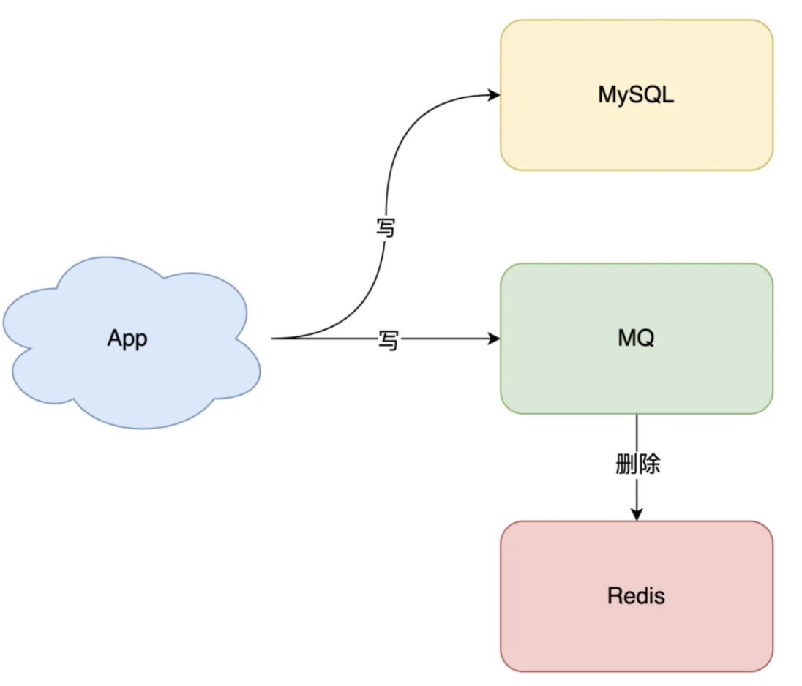
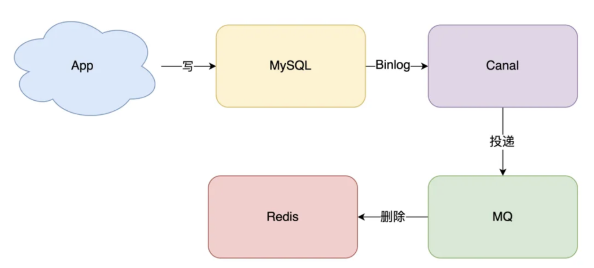

# 谈谈缓存与数据库一致性问题

> 引入缓存能提高应用的性能，但是也会存在缓存与数据库在「读写并发」等情况下出现的数据不一致问题

这里记录一下可用的方案，权当作为知识扩展

## 一些读写策略

### 旁路缓存模式

适用于读请求比较多的场景，以DB数据为主

#### 基础操作

写操作：

- 先更新DB，后删除cache

读操作：

- 先读cache，有则直接返回
- cache没有，则从DB中读取数据，客户端再用DB读到的数据更新cache

> 下面会详细谈谈这种模式

### 读写穿透模式

与上述的模式不同，该模式以cache数据为主，并要求**缓存**能提供`将cache数据写入DB的功能`

#### 基础操作

写操作：

- 先查cache，cache中不存在时，则直接更新DB
- 若cache中存在，则先更新cache，然后由缓存服务自己更新DB(同步更新)

读操作：

- 先从cache中读，有则直接返回
- cache没有，cache服务先从DB加载，再由cache服务返回

#### 其他

> 与`旁路缓存模式`的读写请求由客户端处理不同，`读写穿透模式`则是交给cache服务来处理

> 将数据的读写操作交给cache服务管理：优点减轻了客户端的指责，但是Redis并没有提供将数据写入DB的能力，依然需要我们自己操控；其次，在写操作中，同步更新DB等以cache服务为主的性能影响暂且不谈

### 异步缓存写入

与`读写穿透模式`类似，由cache服务负责读写

不同的是，写操作中，只更新cache，而对DB则作为异步更新

优点在于：用一致性换取了优秀的写性能，适用于数据经常变化却又对数据一致性要求不高的场景，如浏览量、点赞量等

缺点则是：无法保证cache服务的可用性，cache服务挂了则更新不了DB（是否可以通过搭建集群来解决？）

异步写入也常见于**MySQL**的`InnoDB Buffer Pool机制`

## 旁路缓存模式的可用性

> 上述三种策略可以了解到，旁路缓存似乎是限制最少的策略，而我在浏览博客等信息的时候，现在流行的缓存策略也是基于旁路缓存模式

### 为什么不使用更新数据库+更新缓存的方案呢？

这似乎在逻辑上比较合理

但是考虑到现实的问题是，高速缓存的成本不低，其次这样做「缓存利用率」就比较低，且日常场景中，「读操作」远大于「写操作」，缓存应当存取**热点数据**亦或是「有用」数据，虽然会有相对应的**缓存/删除淘汰策略**，但是依然会造成机器性能的浪费，而缓存的更新则交给**读操作**处理

### 论证先`更新数据库，后删除缓存`方案的优越性

首先模拟一个经典的「读写」并发情况：

- 缓存中值Num不存在（数据库中存在）
- **读线程A**发现缓存中没有，去数据库读取Num（Num = 1）
- **写线程B**更新数据库（Num = 2）
- **写线程B**删除缓存（delete Num）
- **读线程A**将Num = 1写入缓存 （Num = 1）

最终Num在缓存中的值还是为旧值1，而在数据库中为新值2

这样看来`更新数据库，后删除缓存`似乎并没有达成数据的一致性

然而这样发生的几率相比于`先删除缓存，后更新数据库`是低很多的，要求达到如下情况：

- 缓存刚好失效，**读线程A**才会将旧值写入缓存
- 「读写」请求刚好并发
- 且要求`写数据库+删除缓存时间`比`读数据库+写缓存时间短`
    - 操作缓存的速度暂且不谈
    - **写数据库操作**一般会比**读数据库操作**时间更长

> 自己可以想一下，三个条件不满足一个就不会出现数据不一致问题
>
> 其次先`删除缓存，再更新数据库`的方案就不赘述了
>
>

### 如何保证更新数据库、删除缓存两步操作的高可用性

开门见上，本质是通过「重试」来保证两部操作的可用性

- 更新数据库操作失败，则在客户端设立好**兜底方法**或**不断重试**
- 删除缓存失败，则交给消息队列操作
    - 消息队列的可靠性能**保证删除缓存操作**能够成功

一个较简单且流行的方案是：

- 订阅数据库的Binlog变更日志（开源中间件Canal或者数据库本身支持）

- 根据变更操作将删除缓存操作投递给消息队列

- 消息队列再删除缓存

  

如此一来我们只需要维护`「订阅变更日志」中间件`的高可用和稳定性即可

> 这里是否需要引入「订阅变更日志」的中间件尚存疑惑，虽然解决了客户端「写MQ」操作失败的问题，但同时也需要维护一个新的中间件
>
> 若是数据库本身支持订阅Binlog日志还好，亦或许是维护「订阅」中间件工作量相比于维护「写MQ」操作失败操作更少？
>
> 笔者还是一名学生，无太多开发经验，这里留个坑

## 强一致性问题

如果别人问你是否能做到**强一致性**，按照我现在的认知来说，答案似乎是**可以但没必要**

引入缓存的目的就是**提高读写性能**，除非财大气粗直接拿缓存作为数据库，但是也得考虑数据的备份、高可用等问题

若达到强一致性，可以参考2PC、3PC等一致性协议，与分布式事务类似的是，高性能和强一致性无法兼得，只能面对不同场景下**有所取舍**

参考：

>https://mp.weixin.qq.com/s?__biz=MzIyOTYxNDI5OA==&mid=2247487312&idx=1&sn=fa19566f5729d6598155b5c676eee62d&chksm=e8beb8e5dfc931f3e35655da9da0b61c79f2843101c130cf38996446975014f958a6481aacf1&scene=178&cur_album_id=1699766580538032128#rd
>
>https://javaguide.cn/database/redis/3-commonly-used-cache-read-and-write-strategies/
