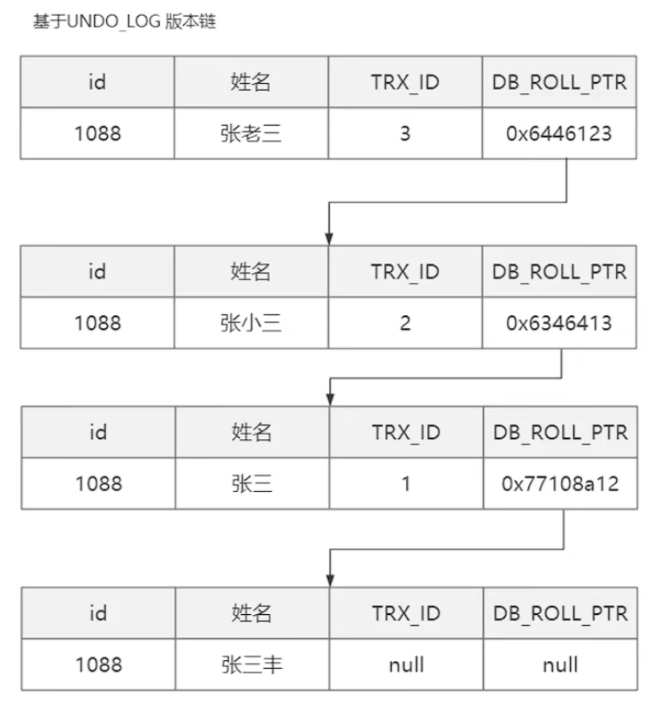
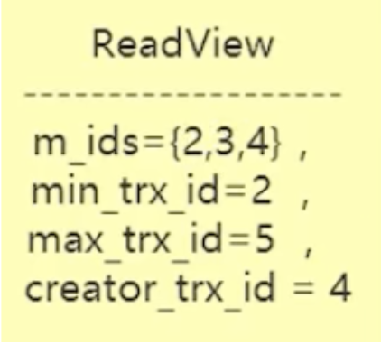

# 简单总结一下MVCC

> MVCC也叫多版本并发控制，用于RC和RR两种隔离级别中，是mysql对于一致性非锁定读的实现，在读写并发情况下能提高一定的性能

简单的说，当读线程读取的行，正在进行DELETE或UPDATE等显示加锁的操作时(当前读)，不会等待行上锁的释放，而会去读取行的一个快照操作(快照读)

## MVCC的实现

MVCC的实现借助于**行隐藏字段**、**undo_log**和**行快照数据**

#### 行隐藏字段

行数据中额外有三个字段用于辅助实现MVCC

- `DB_TRX_ID（6字节）`：表示最后一次插入或更新该行的事务 id

- `DB_ROLL_PTR（7字节）` 回滚指针，指向该行的 `undo log` 。如果该行未被更新，则为空
- `DB_ROW_ID（6字节）`：如果没有设置主键且该表没有唯一非空索引时，`InnoDB` 会使用该 id 来生成聚簇索引

#### undo_log

行的历史版本，基于undo_log维护了行的不同版本链，如下图所示：

维护过程中，若发现旧的行记录没有被行快照记录或者引用，则会删除掉(维护

## 行快照(ReadView)

- `m_ids`：当前活跃事务集合
- `min_trx_id`：说明该事务已经提交了，trx_id < min_trx_id的事务可以访问
- `max_trx_id`：下一个即将被分配事务的ID，trx_id > max_trx_id的事务不可访问
- `Creator_trx_id`：创建该快照的事务ID

用于可见性判断，结合**行快照**和**版本链**可以判定当前**快照读**可以读取哪个历史版本的行数据

## 两种隔离级别中，快照数据的不同

### RC隔离级别

一次事务中，每次的快照读都会生成一个**新快照(ReadView)**，会造成读取的行快照不同，继而造成不可重复读的问题

### RR隔离级别

一次事务中，RR隔离级别下，后续的**快照读**会`复用`第一次**快照读**的快照，因此解决了上述RC隔离界别下不可重复读的问题。

然而，如果快照读不连续，两次快照中夹着一次其他线程的**当前读**操作时，行快照会更新，继而会产生**幻读**的情况

需要使用`Next-key-locks`来解决

> 看到这里就似乎了解，可重复读的隔离级别 和 可重复读的隔离级别的实现是怎样的

