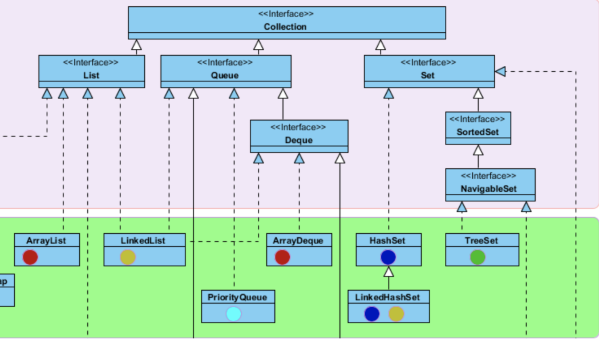
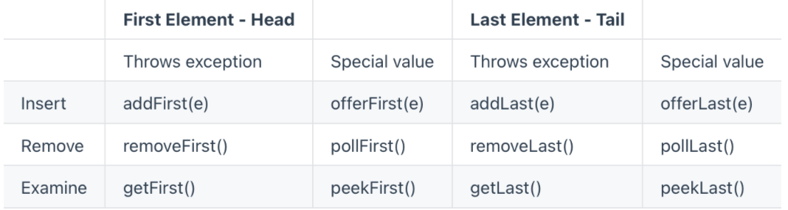
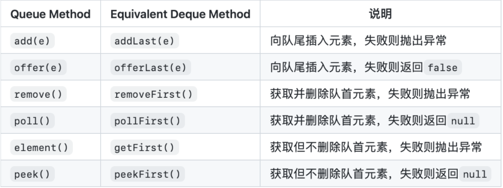
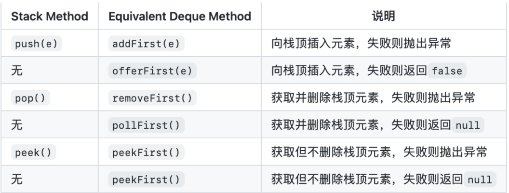
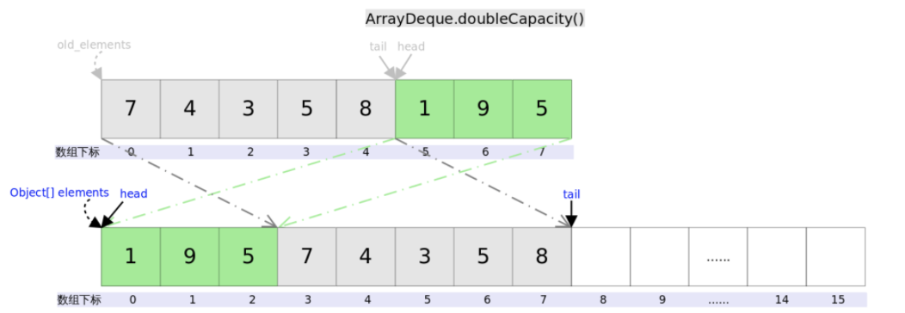

# ArrayDeque


# 开头

本文通过讲解`ArrayDeque`来了解`Stack` && `Queue`

`Deque`是"double ended queue", 表示双向的队列,继承自 Queue接口




除了支持Queue的方法之外，还支持`insert`, `remove`和`examine`操作，由于Deque是双向的，所以可以对队列的头和尾都进行操作，它同时也支持两组格式，一组是抛出异常的实现；另外一组是返回值的实现(没有则返回null)。


Deque的十二个方法如下：



> 实际上很好记，前者为抛出异常的实现()，后者为返回值的实现(没有时返回null)，
>
> 队列的头和尾都进行操作(增、删、查)，这就是十二个方法


下表列出了*Deque*与*Queue*相对应的接口:




下表列出了*Deque*与*Stack*对应的接口：



> 当需要使用栈时，Java已不推荐使用*Stack*这个类，而是推荐使用更高效的*ArrayDeque*；既然*Queue*只是一个接口，当需要使用队列时也就首选*ArrayDeque*了(次选是*LinkedList*)。


# ArrayDeque的实现

*ArrayDeque*和*LinkedList*是*Deque*的两个通用实现,但官方更推荐使用ArrayDeque来实现栈和队列的功能

## ArrayDeque的底层数据结构

ArrayDeque一看名字就知道是使用数组来实现队列操作，故而该数组必须是循环的，且ArrayDeque是非线程安全的

## 构造函数

```java
// 数组本体
transient Object[] elements; 
// 指向队列首端第一个元素
transient int head;
// 指向队列尾端最后一个元素的下一个可插入空位
// 而不是指向队尾元素
transient int tail;

private static final int MIN_INITIAL_CAPACITY = 8;
```


这三个方法为ArrayDeque的构造方法

```java
// 构造一个空数组deque，初始容量足以容纳16个元素。
public ArrayDeque() {
    elements = new Object[16];
}

// 构造一个空数组deque，初始容量足以容纳指定数量的元素。
public ArrayDeque(int numElements) {
    allocateElements(numElements);
}
// 构造一个包含指定集合元素的deque，按照它们由集合的迭代器返回的顺序。
public ArrayDeque(Collection<? extends E> c) {
    allocateElements(c.size());
    addAll(c);
}
```


## 扩容

再将方法解析之前，先讲讲扩容

在**构造函数需要构造指定大小的数组**OR上述提到**有关添加的操作**都会涉及到数组的扩容

ArrayDeque的扩容是新直接申请**两倍**(左移一位)的数组空间，然后将原来的数组使用复制`System.arraycopy`过去



```java
private void doubleCapacity() {
    assert head == tail;
    int p = head;
    int n = elements.length; //旧数组的大小
    int r = n - p; // head右边的元素个数
    int newCapacity = n << 1; // 新申请数组的大小
    if (newCapacity < 0)
        throw new IllegalStateException("Sorry, deque too big");
    Object[] a = new Object[newCapacity];
    System.arraycopy(elements, p, a, 0, r);//复制右半部分，对应上图中绿色部分
    System.arraycopy(elements, 0, a, r, p);//复制左半部分，对应上图中灰色部分
    elements = a;
    head = 0;
    tail = n;
}
```

>  结合这两张图就应该很好理解了


## 方法解析

## 添加

### offerFirst()

> 在此deque前面插入指定的元素。

我们可以看到，抛出异常的`offerFirst`是调用的`addFirst()`

```java
public boolean offerFirst(E e) {
    addFirst(e);
    return true;
}
```


### addFirst()

> 在此deque前面插入指定的元素。

接着我们来看`addFirst()`

`addFirst(E e)`的作用是在*Deque*的首端插入元素，也就是在`head`的前面插入元素，在空间足够且下标没有越界的情况下，只需要将`elements[--head] = e`即可。

```java
public void addFirst(E e) {
    if (e == null) //不允许放入null
        throw new NullPointerException();
    elements[head = (head - 1) & (elements.length - 1)] = e; //下标是否越界
    if (head == tail) //判断数组是否够用
        doubleCapacity(); //扩容
}
```

>  这一段代码写的很有意思

首先，`tail`指向的总是下一个可插入空位(n)，**解决了插入空间不够的问题**

其次，来看看`head = (head - 1) & (elements.length - 1)`这一段代码，`elements.length`总是为2的指数次方(初始容量为2^ 4，扩容每次加倍)，故`elements.length - 1`的低位**全为1**和`head - 1`取余数后等于是**取模**了，解决了

`head - 1`为负数的情况(即数组越界的问题)


### offerLast()

> 在此deque的末尾插入指定的元素。

同样直接调用了`addLast()`

```java
public boolean offerLast(E e) {
    addLast(e);
    return true;
}
```

### addLast()

> 在此deque的末尾插入指定的元素。

上面的addLast提到了，tail总是指向下一个可插入空位，直接`elements[tail] = e`即可

```java
public void addLast(E e) {
    if (e == null)
        throw new NullPointerException();
    elements[tail] = e;
    if ( (tail = (tail + 1) & (elements.length - 1)) == head) //数组下标越界处理
        doubleCapacity();
}
```


## 删除

### removeFirst()

> 检索并删除此deque的第一个元素。

同样是调用了`pollFirst()`，相比`pollFirst()`多抛了一个`NoSuchElementException()`的异常

```java
public E removeFirst() {
    E x = pollFirst();
    if (x == null)
        throw new NoSuchElementException();
    return x;
}
```


### pollFirst()

> 检索并删除此deque的第一个元素，如果此deque为空，则返回 `null` 。

开头讲到，ArrayList不允许放入null，则当`elements[h] = null;`的时候，意味着队列为空

```java
public E pollFirst() {
    int h = head;
    @SuppressWarnings("unchecked")
    E result = (E) elements[h];
    if (result == null)
        return null;
    elements[h] = null;     // 队列为空
    head = (h + 1) & (elements.length - 1); //下标越界检查
    return result;
}
```


### removeLast()

> 检索并删除此deque的最后一个元素。

同理`removeFirst()`

```java
public E removeLast() {
    E x = pollLast();
    if (x == null)
        throw new NoSuchElementException();
    return x;
}
```

### pollLast()

> 检索并删除此deque的最后一个元素，如果此deque为空，则返回 `null` 。

移除的是`tail`位置前一个元素

```java
public E pollLast() {
    int t = (tail - 1) & (elements.length - 1);
    @SuppressWarnings("unchecked")
    E result = (E) elements[t];
    if (result == null)
        return null;
    elements[t] = null;
    tail = t;
    return result;
}
```


## 检索

这个与上面删除的区别是

- 删除 = 删除元素 + 检索(返回删除的元素）
- 检索 =  返回该元素

就是**get**的意思？

### getFirst()

> 检索，但不删除，这个deque的第一个元素。

```java
public E getFirst() {
    @SuppressWarnings("unchecked")
    E result = (E) elements[head];
    if (result == null)
        throw new NoSuchElementException();
    return result;
}
```

### peekFirst()

> 检索但不删除此deque的第一个元素，如果此deque为空，则返回 `null`

```java
@SuppressWarnings("unchecked")
public E peekFirst() {
    // elements[head] is null if deque empty
    return (E) elements[head];
}
```

### getLast()

> 检索，但不删除，这个deque的最后一个元素。

```java
public E getLast() {
    @SuppressWarnings("unchecked")
    E result = (E) elements[(tail - 1) & (elements.length - 1)];
    if (result == null)
        throw new NoSuchElementException();
    return result;
}
```

### peekLast()

> 检索但不删除此deque的最后一个元素，或返回 `null`如果此deque为空）。

```java
@SuppressWarnings("unchecked")
public E peekLast() {
    return (E) elements[(tail - 1) & (elements.length - 1)];
}
```

> 注意⚠️：
>
> 检索的`getFirst()`和`getLast()`会对null抛出异常

