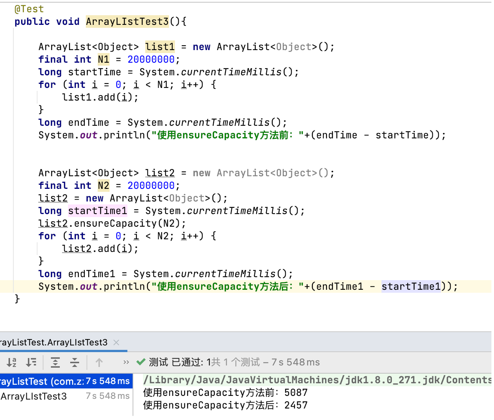

# ArrayList

# 开头

可调整大小的数组,实现`List`接口。 实现所有可选列表操作，并允许所有元素，包括`null` 。 除了实现List `接口`之外，该类还提供了一些方法来操纵内部使用的存储列表的数组的大小。 （这个类是大致相当于`Vector，`不同之处在于它是不同步的）。

# ArrayList的实现

## ArrayList的底层数据结构

```java
		/**
     * The array buffer into which the elements of the ArrayList are stored.
     * The capacity of the ArrayList is the length of this array buffer. Any
     * empty ArrayList with elementData == DEFAULTCAPACITY_EMPTY_ELEMENTDATA
     * will be expanded to DEFAULT_CAPACITY when the first element is added.
     */
    transient Object[] elementData; // non-private to simplify nested class access
```


## 构造函数

```java
    /**
     * Constructs an empty list with the specified initial capacity.
     *
     * @param  initialCapacity  the initial capacity of the list
     * @throws IllegalArgumentException if the specified initial capacity
     *         is negative
     */
    public ArrayList(int initialCapacity) {
        if (initialCapacity > 0) {
            this.elementData = new Object[initialCapacity];
        } else if (initialCapacity == 0) {
            //在jdk7时，element初始化为长度为10的数组
            //在jdk8后，elementData初始化为{}，并没有创建长度，在第一次调用add()后才创建长度
            //其中，private static final Object[] EMPTY_ELEMENTDATA = {};
            this.elementData = EMPTY_ELEMENTDATA;
        } else {
            throw new IllegalArgumentException("Illegal Capacity: "+
                                               initialCapacity);
        }
    }

    /**
     * Constructs an empty list with an initial capacity of ten.
     */
    public ArrayList() {
        //其中 private static final Object[] DEFAULTCAPACITY_EMPTY_ELEMENTDATA = {};
        this.elementData = DEFAULTCAPACITY_EMPTY_ELEMENTDATA;
    }

    /**
     * Constructs a list containing the elements of the specified
     * collection, in the order they are returned by the collection's
     * iterator.
     *
     * @param c the collection whose elements are to be placed into this list
     * @throws NullPointerException if the specified collection is null
     */
    public ArrayList(Collection<? extends E> c) {
        Object[] a = c.toArray();
        if ((size = a.length) != 0) {
            if (c.getClass() == ArrayList.class) {
                elementData = a;
            } else {
                elementData = Arrays.copyOf(a, size, Object[].class);
            }
        } else {
            // replace with empty array.
            elementData = EMPTY_ELEMENTDATA;
        }
    }
```


## 扩容

### ensureCapacity()

> 扩容操作最终是通过`grow()`方法完成的

向 ArrayList 添加大量元素之前最好先使用`ensureCapacity` 方法，以减少增量重新分配的次数。能减少`add()`所耗费的时间



`ensureCapacity` 方法内大致的执行顺序是：

- `ensureCapacity()` —>`ensureCapacityInternal()`—>`ensureExplicitCapacity()`—>`grow()`—>`Arrays.copyOf()`

```java
    /**
     * Increases the capacity of this <tt>ArrayList</tt> instance, if
     * necessary, to ensure that it can hold at least the number of elements
     * specified by the minimum capacity argument.
     *
     * @param   minCapacity   the desired minimum capacity
     */
		//如果需要，增加此 ArrayList实例的容量，以确保它可以至少保存最小容量参数指定的元素数。
    public void ensureCapacity(int minCapacity) {
        int minExpand = (elementData != DEFAULTCAPACITY_EMPTY_ELEMENTDATA)
            // any size if not default element table
            ? 0
            // larger than default for default empty table. It's already
            // supposed to be at default size.
            : DEFAULT_CAPACITY;

        if (minCapacity > minExpand) {
            ensureExplicitCapacity(minCapacity);
        }
    }
    //当minCapacity小于10(DEFAULT_CAPACITY)时，返回10(DEFAULT_CAPACITY)
    private static int calculateCapacity(Object[] elementData, int minCapacity) {
        if (elementData == DEFAULTCAPACITY_EMPTY_ELEMENTDATA) {
            return Math.max(DEFAULT_CAPACITY, minCapacity);
        }
        return minCapacity;
    }

    private void ensureCapacityInternal(int minCapacity) {
        ensureExplicitCapacity(calculateCapacity(elementData, minCapacity));
    }
    // 判断是否申请额外空间：如果申请容量比当前数组元素的实际长度大 则进入方法 grow
    private void ensureExplicitCapacity(int minCapacity) {
        modCount++;

        // overflow-conscious code
        if (minCapacity - elementData.length > 0)
            grow(minCapacity);
    }

    /**
     * The maximum size of array to allocate.
     * Some VMs reserve some header words in an array.
     * Attempts to allocate larger arrays may result in
     * OutOfMemoryError: Requested array size exceeds VM limit
     */
    private static final int MAX_ARRAY_SIZE = Integer.MAX_VALUE - 8;

    /**
     * Increases the capacity to ensure that it can hold at least the
     * number of elements specified by the minimum capacity argument.
     *
     * @param minCapacity the desired minimum capacity
     */
    private void grow(int minCapacity) {
        // overflow-conscious code
      	// 原数组长度
        int oldCapacity = elementData.length;
      	// 新数组长度约为原数组长度的1.5倍
        int newCapacity = oldCapacity + (oldCapacity >> 1);
        if (newCapacity - minCapacity < 0)
            newCapacity = minCapacity;
        if (newCapacity - MAX_ARRAY_SIZE > 0)
            newCapacity = hugeCapacity(minCapacity);
        // minCapacity is usually close to size, so this is a win:
        elementData = Arrays.copyOf(elementData, newCapacity);
    }
		//这一步说明了数组的最大长度可以为Integer.MAX_VALUE
		//而不是之前定义的Integer.MAX_VALUE - 8;
    private static int hugeCapacity(int minCapacity) {
        if (minCapacity < 0) // overflow
            throw new OutOfMemoryError();
        return (minCapacity > MAX_ARRAY_SIZE) ?
            Integer.MAX_VALUE :
            MAX_ARRAY_SIZE;
    }
```


## 方法解析

### add()

其中，`add(int index, E element)`具有线性的时间复杂度

```java
    /**
     * Appends the specified element to the end of this list.
     *
     * @param e element to be appended to this list
     * @return <tt>true</tt> (as specified by {@link Collection#add})
     */
    public boolean add(E e) {
        ensureCapacityInternal(size + 1);  // Increments modCount!!
        elementData[size++] = e;
        return true;
    }

    /**
     * Inserts the specified element at the specified position in this
     * list. Shifts the element currently at that position (if any) and
     * any subsequent elements to the right (adds one to their indices).
     *
     * @param index index at which the specified element is to be inserted
     * @param element element to be inserted
     * @throws IndexOutOfBoundsException {@inheritDoc}
     */
    public void add(int index, E element) {
      	// 检查index是否符合要求
      	// 否则抛出IndexOutOfBoundsException异常
        rangeCheckForAdd(index);

        ensureCapacityInternal(size + 1);  // Increments modCount!!co
      	// 拷贝操作
        System.arraycopy(elementData, index, elementData, index + 1,
                         size - index);
        elementData[index] = element;
        size++;
    }
```


### addAll

根据位置不同也有两个版本， `addAll()`的时间复杂度不仅跟插入元素的多少有关，也跟插入的位置相关。

```java
public boolean addAll(Collection<? extends E> c) {
        Object[] a = c.toArray();
        int numNew = a.length;
        ensureCapacityInternal(size + numNew);  // Increments modCount
        System.arraycopy(a, 0, elementData, size, numNew);
        size += numNew;
        return numNew != 0;
    }

```

```java
public boolean addAll(int index, Collection<? extends E> c) {
  			//检查index是否合格，否则抛出IndexOutOfBoundsException异常
        rangeCheckForAdd(index);

        Object[] a = c.toArray();
        int numNew = a.length;
        ensureCapacityInternal(size + numNew);  // Increments modCount

        int numMoved = size - index;
        if (numMoved > 0)
            System.arraycopy(elementData, index, elementData, index + numNew,
                             numMoved);

        System.arraycopy(a, 0, elementData, index, numNew);
        size += numNew;
        return numNew != 0;
    }
```


### remove()

`remove()`方法也有两个版本

一个是`remove(int index)`删除指定位置的元素

另一个是`remove(Object o)`删除第一个满足`o.equals(elementData[index])`的元素.

删除操作是`add()`操作的逆过程，需要将删除点之后的元素向前移动一个位置。

> 最后一个位置不手动赋`null`值，除非对应的位置被其他元素覆盖，否则原来的对象就一直不会被回收。

```java
    /**
     * Removes the element at the specified position in this list.
     * Shifts any subsequent elements to the left (subtracts one from their
     * indices).
     *
     * @param index the index of the element to be removed
     * @return the element that was removed from the list
     * @throws IndexOutOfBoundsException {@inheritDoc}
     */
    public E remove(int index) {
        rangeCheck(index);

        modCount++;
        E oldValue = elementData(index);

        int numMoved = size - index - 1;
        if (numMoved > 0)
            System.arraycopy(elementData, index+1, elementData, index,
                             numMoved);
        elementData[--size] = null; // clear to let GC do its work

        return oldValue;
    }
```

```java
    /**
     * Removes the first occurrence of the specified element from this list,
     * if it is present.  If the list does not contain the element, it is
     * unchanged.  More formally, removes the element with the lowest index
     * <tt>i</tt> such that
     * <tt>(o==null&nbsp;?&nbsp;get(i)==null&nbsp;:&nbsp;o.equals(get(i)))</tt>
     * (if such an element exists).  Returns <tt>true</tt> if this list
     * contained the specified element (or equivalently, if this list
     * changed as a result of the call).
     *
     * @param o element to be removed from this list, if present
     * @return <tt>true</tt> if this list contained the specified element
     */
    public boolean remove(Object o) {
        if (o == null) {
            for (int index = 0; index < size; index++)
                if (elementData[index] == null) {
                    fastRemove(index);
                    return true;
                }
        } else {
            for (int index = 0; index < size; index++)
                if (o.equals(elementData[index])) {
                    fastRemove(index);
                    return true;
                }
        }
        return false;
    }
```


###  trimToSize()

把扩容后未使用的空间去掉，保留有元素的部分

```java
    /**
     * Trims the capacity of this <tt>ArrayList</tt> instance to be the
     * list's current size.  An application can use this operation to minimize
     * the storage of an <tt>ArrayList</tt> instance.
     */
    public void trimToSize() {
        modCount++;
        if (size < elementData.length) {
          	//复制了elementData中的size个有效元素，再重新给elementData
            elementData = (size == 0)
              ? EMPTY_ELEMENTDATA
              : Arrays.copyOf(elementData, size);
        }
    }
```


## 关于modCount

ArrayList虽然是线程不安全的，但是也有快速失败的机制，通过记录`modCount`参数来实现。

可以看到源码中有很多`modCount++;`的操作,每一次ArrayList结构发生改变的时候(上述提到的所有方法)，都会记录一次，在面对并发的修改时，迭代器很快就会完全失败，而不是冒着在将来某个不确定时间发生任意不确定行为的风险。

用此变量来检验在迭代过程中List对象是否被修改了，如果被修改了则抛出来java.util.ConcurrentModificationException异常


## 关于 Arrays.copyOf 和 System.arraycopy

### Arrays.copyOf

```java
    public static <T,U> T[] copyOf(U[] original, int newLength, Class<? extends T[]> newType) {
        @SuppressWarnings("unchecked")
        T[] copy = ((Object)newType == (Object)Object[].class)
            ? (T[]) new Object[newLength]
            : (T[]) Array.newInstance(newType.getComponentType(), newLength);
        System.arraycopy(original, 0, copy, 0,
                         Math.min(original.length, newLength));
        return copy;
    }
```

### System.arraycopy

```java
public static native void arraycopy(Object src,  int  srcPos,
                                        Object dest, int destPos,
                                        int length);
```

可以看到，Arrays.copyOf内调用了System.arraycopy。

简单的说，Array.copyOf()可以看作是受限的System.arraycopy(),它主要是用来将原数组全部拷贝到一个新长度的数组，适用于数组扩容。