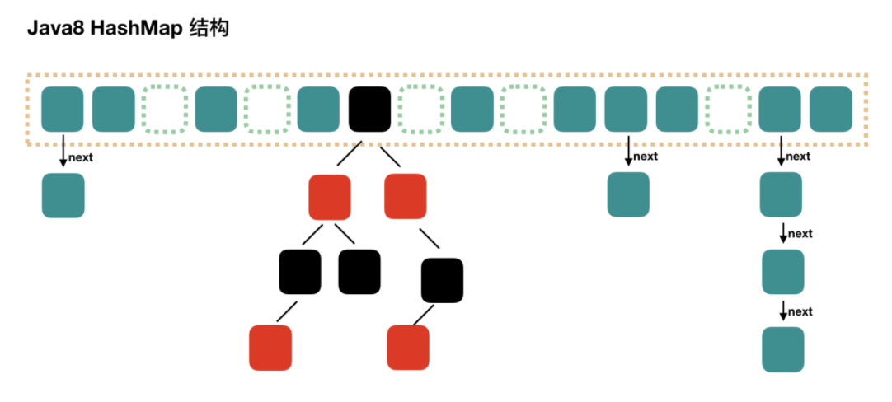

# HashMap & HashSet

# 开头

*HashMap*实现了*Map*接口，即允许放入`key`为`null`的元素，也允许插入`value`为`null`的元素。

除该类未实现同步外，其余跟`Hashtable`大致相同；

跟*TreeMap*不同，该容器不保证元素顺序，根据需要该容器可能会对元素重新哈希，元素的顺序也会被重新打散，因此不同时间迭代同一个*HashMap*的顺序可能会不同。


# HashMap的实现

## HashMap的底层数据结构

相比于JDK7的数组+链表的方式

JDK8中采用了`数组+链表+红黑树`的方式来构造一个HashMap



JDK8中，当链表的一个节点上的元素达到8个的时候，会将链表结构转换为`红黑树`

## 构造函数

HashMap默认构造容量是16

> static final int DEFAULT_INITIAL_CAPACITY = 1 << 4;

```java
public HashMap(int initialCapacity) {
        this(initialCapacity, DEFAULT_LOAD_FACTOR);
    }
```

```java
public HashMap() {
        this.loadFactor = DEFAULT_LOAD_FACTOR; // all other fields defaulted
    }
```

```java
public HashMap(Map<? extends K, ? extends V> m) {
        this.loadFactor = DEFAULT_LOAD_FACTOR;
        putMapEntries(m, false);
    }
```

其中，`DEFAULT_LOAD_FACTOR`也被称为负载因子，默认是**0.75f**。

> ```java
> static final float DEFAULT_LOAD_FACTOR = 0.75f;
> ```

负载因子是衡量哈希表在容量自动增加之前允许其达到多大的度量。当散列表中的条目数量超过负载因子和当前容量的乘积时，将重处理散列表（即重建内部数据结构），使散列表的桶数约为两倍。

至于为什么是0.75而不是其他，呵呵，JDK里说是泊松定律得出的0.7-0.8之间冲突最小？作为一名学习过概率论的大学僧，我也不记得了。。。

这里可以参考一下`StackOverFlow`的一个回答，大意是，桶空和非空的机率是0.5，由牛顿二项性可以知道，0.75更接近于log2(0.69)，可能负载因子在0.69-0.75性能会更好，但是0.75也不是不行(可能是考虑到位运算效率比较高)


总结，负载因子太小了浪费空间并且会发生更多次数的resize，太大了哈希冲突增加会导致性能不好(增加了查找的开销)


## 方法解析

### put()

```java
public V put(K key, V value) {
        return putVal(hash(key), key, value, false, true);
    }
		//第一个参数hash(key)，获得key对应的哈希值，当key为null时，哈希值为0
    //第二、三个参数为存储的键值对
    //第四个参数onlyIfAbsent如果是 true，那么只有在不存在该 key 时才会进行 put 操作
    final V putVal(int hash, K key, V value, boolean onlyIfAbsent,
                   boolean evict) {
        Node<K,V>[] tab; Node<K,V> p; int n, i;
        //如果是哈希表第一次put值，会触发resize()来初始化数组长度
        //第一次resize数组初始化到 16 OR 自定义容量 的大小
        if ((tab = table) == null || (n = tab.length) == 0)
            n = (tab = resize()).length;
        //找到数组下标，如果该位置为空，则放入Node节点
        // p为对应数组位置的链表节点
        if ((p = tab[i = (n - 1) & hash]) == null)
            tab[i] = newNode(hash, key, value, null);
        //该位置不为空
        else {
            // e为辅助节点，用来记录key值与新插入节点相同的旧节点
            Node<K,V> e; K k;
            //判断该链表第一个节点和我们要插入的key是否相同，相同则取出该节点
            //PS：之前就听说过HashMap的put会更新key对应的value值
            if (p.hash == hash &&
                ((k = p.key) == key || (key != null && key.equals(k))))
                e = p;
            //如果该节点为红黑树节点，则调用红黑树的插入方法
            else if (p instanceof TreeNode)
                e = ((TreeNode<K,V>)p).putTreeVal(this, tab, hash, key, value);
            //此时，可以说明该位置上是一个链表(位置不为空且不满足上述判断)
            else {
                //遍历链表
                for (int binCount = 0; ; ++binCount) {
                    //插入到链表的结尾(JDK7中是插入到链表的头部)
                    if ((e = p.next) == null) {
                        p.next = newNode(hash, key, value, null);
                        //TREEIFY_THRESHOLD为8，当插入节点后该数组链表节点为8时
                        // 会使用treeifyBin将该链表转换为红黑树
                        if (binCount >= TREEIFY_THRESHOLD - 1) // -1 for 1st
                            treeifyBin(tab, hash);
                        break;
                    }
                    //当遍历到相同key值的节点时，直接break
                    if (e.hash == hash &&
                        ((k = e.key) == key || (key != null && key.equals(k))))
                        break;
                    //此时e为链表中与新插入节点node的key相等的旧节点
                    p = e;
                }
            }
            //e不为null，说明存在key相等的旧节点
            if (e != null) { // existing mapping for key
                V oldValue = e.value;
                if (!onlyIfAbsent || oldValue == null)
                    //用新的value覆盖旧节点的value
                    e.value = value;
                afterNodeAccess(e);
                return oldValue;
            }
        }
        ++modCount;
        //如果 HashMap在插入该节点后超出了阈值，则会进行扩容
        if (++size > threshold)
            resize();
        afterNodeInsertion(evict);
        return null;
    }
```

> 关于第五个参数 evict，在出现了一下，查阅一下博客了解到，afterNodeInsertion方法的evict参数如果为false，表示哈希表处于创建模式。只有在使用Map集合作为构造器创建LinkedHashMap或HashMap时才会为false，使用其他构造器创建的LinkedHashMap，之后再调用put方法，该参数均为true。

> 这里put()方法对于辅助节点p、e的使用有无法描述的感觉。。。

> JDK7是先判断是否要扩容再插入，JDK8是先插入再判断是否要扩容，但是都无关大雅了。。。


### get()

```java
public V get(Object key) {
        Node<K,V> e;
        return (e = getNode(hash(key), key)) == null ? null : e.value;
    }

    final Node<K,V> getNode(int hash, Object key) {
        Node<K,V>[] tab; Node<K,V> first, e; int n; K k;
        if ((tab = table) != null && (n = tab.length) > 0 &&
            (first = tab[(n - 1) & hash]) != null) {
            //当第一个节点就是所需要的节点时，直接return
            if (first.hash == hash && // always check first node
                ((k = first.key) == key || (key != null && key.equals(k))))
                return first;
            if ((e = first.next) != null) {
                //当判断第一个节点是红黑树节点时，调用红黑树的get方法
                if (first instanceof TreeNode)
                    return ((TreeNode<K,V>)first).getTreeNode(hash, key);
                //遍历链表
                do {
                    if (e.hash == hash &&
                        ((k = e.key) == key || (key != null && key.equals(k))))
                        return e;
                } while ((e = e.next) != null);
            }
        }
        return null;
    }
```

> get相比于put的操作就是小儿科罢了。。。


### resize()

数组扩容方法，在put()中提到过

> 写注释之前，一看那么长就知道是一场大战了。。。

```java
final Node<K,V>[] resize() {
        Node<K,V>[] oldTab = table;
        //旧数组容量
        int oldCap = (oldTab == null) ? 0 : oldTab.length;
        //旧数组阈值
        int oldThr = threshold;
        //新数组容量OR阈值
        int newCap, newThr = 0;
        //开始扩容
        if (oldCap > 0) {
            //当旧数组容量>=最大容量时,将阈值扩大到最大容量大小
            //MAXIMUM_CAPACITY = 1 << 30
            if (oldCap >= MAXIMUM_CAPACITY) {
                threshold = Integer.MAX_VALUE;
                return oldTab;
            }
            //容量/阈值扩大一倍
            else if ((newCap = oldCap << 1) < MAXIMUM_CAPACITY &&
                     oldCap >= DEFAULT_INITIAL_CAPACITY)
                newThr = oldThr << 1; // double threshold
        }
        // 对应使用 new HashMap(int initialCapacity) 初始化后，第一次 put 的时候
        else if (oldThr > 0) // initial capacity was placed in threshold
            newCap = oldThr;
        // 对应使用 new HashMap() 初始化后，第一次 put 的时候
        else {               // zero initial threshold signifies using defaults
            newCap = DEFAULT_INITIAL_CAPACITY;
            newThr = (int)(DEFAULT_LOAD_FACTOR * DEFAULT_INITIAL_CAPACITY);
        }
        if (newThr == 0) {
            float ft = (float)newCap * loadFactor;
            newThr = (newCap < MAXIMUM_CAPACITY && ft < (float)MAXIMUM_CAPACITY ?
                      (int)ft : Integer.MAX_VALUE);
        }
        threshold = newThr;
        @SuppressWarnings({"rawtypes","unchecked"})
        //初始化一个新数组
        Node<K,V>[] newTab = (Node<K,V>[])new Node[newCap];
        table = newTab;
        //原数组为初始化数组时，到这里已经结束
        //遍历数组进行数据迁移
        if (oldTab != null) {
            for (int j = 0; j < oldCap; ++j) {
                Node<K,V> e;
                if ((e = oldTab[j]) != null) {
                    oldTab[j] = null;
                    //当该数组只有一个元素时，直接迁移这个元素
                    if (e.next == null)
                        newTab[e.hash & (newCap - 1)] = e;
                    //红黑树节点的迁移
                    else if (e instanceof TreeNode)
                        ((TreeNode<K,V>)e).split(this, newTab, j, oldCap);
                    else { // preserve order
                        //处理链表
                        // 需要将此链表拆成两个链表，放到新的数组中，并且保留原来的先后顺序
                        // loHead、loTail 对应一条链表的头尾，hiHead、hiTail 对应另一条链表头尾
                        Node<K,V> loHead = null, loTail = null;
                        Node<K,V> hiHead = null, hiTail = null;
                        Node<K,V> next;
                        do {
                            next = e.next;
                            if ((e.hash & oldCap) == 0) {
                                if (loTail == null)
                                    loHead = e;
                                else
                                    loTail.next = e;
                                loTail = e;
                            }
                            else {
                                if (hiTail == null)
                                    hiHead = e;
                                else
                                    hiTail.next = e;
                                hiTail = e;
                            }
                        } while ((e = next) != null);
                        if (loTail != null) {
                            loTail.next = null;
                            //迁移第一条链表
                            newTab[j] = loHead;
                        }
                        if (hiTail != null) {
                            hiTail.next = null;
                            //迁移第二条链表，放在了不同的位置上
                            newTab[j + oldCap] = hiHead;
                        }
                    }
                }
            }
        }
        return newTab;
    }
```


## HashSet

> 你以为还没结束嘛？不不不，HashSet是对HashMap的进一层包装，内部对应的方法都是调用HashMap的，是不是很懒？

> 那我也懒得贴代码了，自己去看吧👀

> 参考自：
>
> https://github.com/CarpenterLee/JCFInternals/blob/master/markdown/6-HashSet%20and%20HashMap.md
>
> https://www.pdai.tech/md/java/collection/java-map-HashMap&HashSet.html#数组扩容

