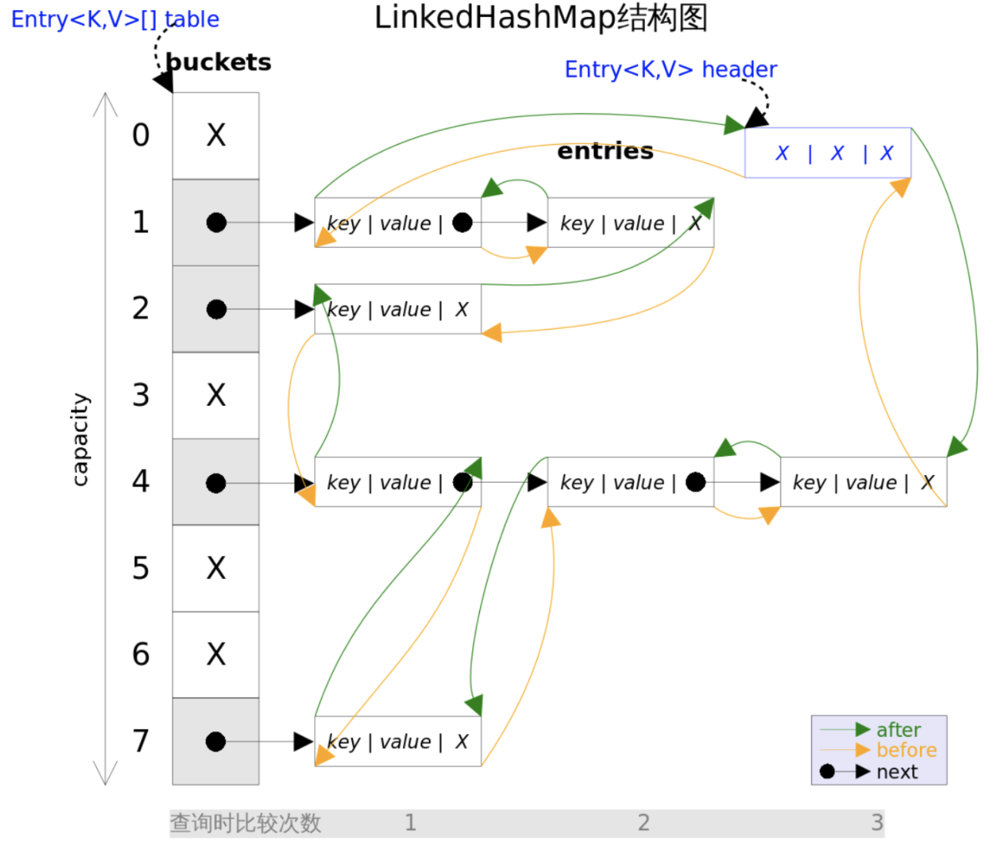
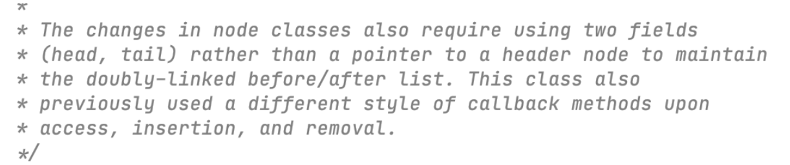
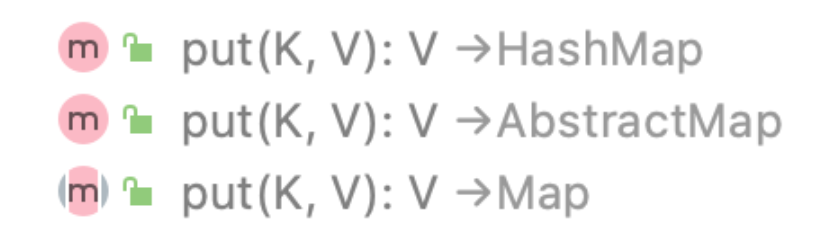
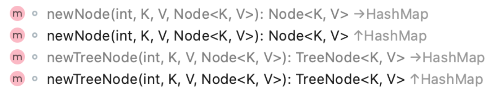
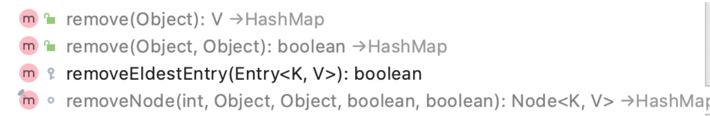
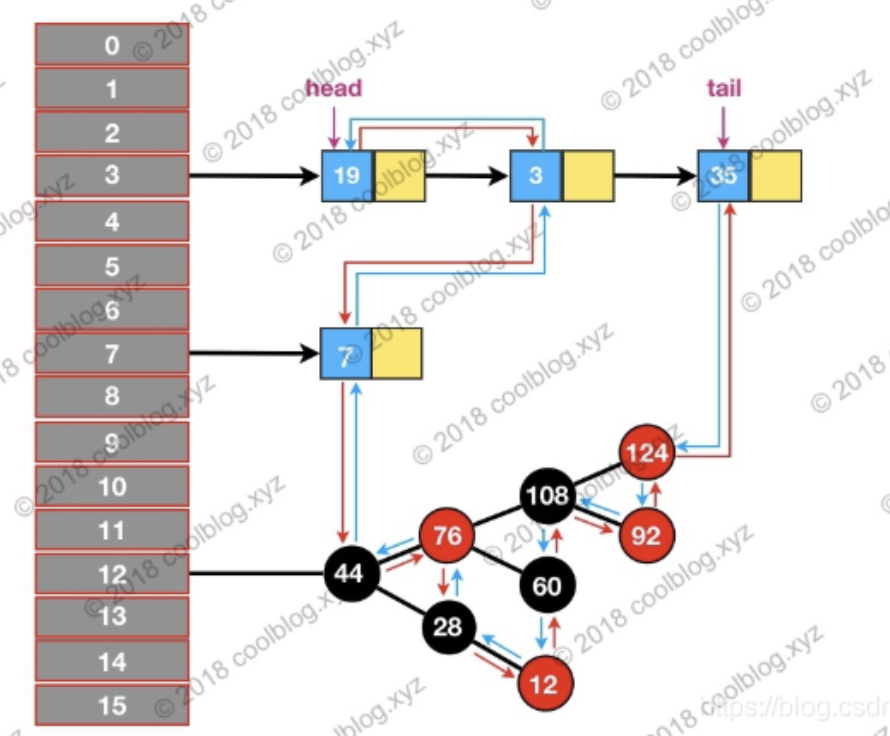

## LinkedHashMap

> 做过一道LRU缓存的力扣算法题，本质就是自己实现一个LinkedHashMap，来实现FIFO的替换策略缓存：
>
> #### [146. LRU 缓存机制](https://leetcode-cn.com/problems/lru-cache/)

## 开头

*LinkedHashMap*实现了*Map*接口，即允许放入`key`为`null`的元素，也允许插入`value`为`null`的元素。它同时满足*HashMap*和*linked list*的某些特性。**可将*LinkedHashMap*看作采用*LinkedList*增强的*HashMap*。**

## LinkedHashMap的实现

```java
static class Entry<K,V> extends HashMap.Node<K,V> {
        Entry<K,V> before, after;
        Entry(int hash, K key, V value, Node<K,V> next) {
            super(hash, key, value, next);
        }
    }
```

> 这里，可以看到LinkedHashMap的Entry多了 before，after
>
> 其中before、after用来维护Entry**插入的先后顺序**(下图中的**绿、黄**箭头)
>
> 而next是用来维护table上**连接的Entry的顺序**的（下图中的**黑**箭头）

### ArrayDeque的底层数据结构
> 该图基于是JDK7，JDK8中已经不采用header，而是采用head、tail来识别队头、队尾



**LinkedHashMap**相比于**HashMap**，通过`after、before`维护了一个**双向链表**将每个Entry连接一起，这样遍历的时候，可以根据Entry的插入顺序进行 **顺序遍历**

```java
    /**
     * The head (eldest) of the doubly linked list.
     */
    transient LinkedHashMap.Entry<K,V> head;

    /**
     * The tail (youngest) of the doubly linked list.
     */
    transient LinkedHashMap.Entry<K,V> tail;
```

其中，链表的头部`head`是一个哑元，仅作指示作用

> ⚠️在之前HashMap的时候已经知道了table默认初始化容量为16，head的哈希值为-1，**不占用**初始化容量大小，仅仅作为记录 第一个插入 OR 最久访问 的Entry的元素是谁

> ⚠️在JDK7中采用的是**header**作为头指针，而在JDK8的源码时已经找不到`header`了，相反是使用了`head`和`tail`两个头尾指针来取代`header`,在源码中注释也是这么说的
>
> 


### 构造函数

> `accessOrder` 控制访问的顺序，后面会介绍到

```java
    /**
     * The iteration ordering method for this linked hash map: <tt>true</tt>
     * for access-order
     * true 表示 最近 最少使用次序(LRU)， false 表示 插入顺序
     */
    final boolean accessOrder;
```


默认构造方法

```java
public LinkedHashMap() {
        super();
        accessOrder = false;
    }
```

指定初始容量 `initialCapacity`

```java
public LinkedHashMap(int initialCapacity) {
        super(initialCapacity);
        accessOrder = false;
    }
```

指定初始容量`initialCapacity`   负载因子`float loadFactor`

```java
public LinkedHashMap(int initialCapacity, float loadFactor) {
        super(initialCapacity, loadFactor);
        accessOrder = false;
    }
```

指定初始容量`initialCapacity`   负载因子`float loadFactor`  访问顺序`accessOrder`

```java
public LinkedHashMap(int initialCapacity,
                         float loadFactor,
                         boolean accessOrder) {
        super(initialCapacity, loadFactor);
        this.accessOrder = accessOrder;
    }
```

通过传入的`map`创建一个**LinkedHashMap**，容量为默认容量（16）和`(map.zise()/DEFAULT_LOAD_FACTORY)+1`的较大者，装载因子为默认值

```java
public LinkedHashMap(Map<? extends K, ? extends V> m) {
        super();
        accessOrder = false;
        putMapEntries(m, false);
    }
```

> 可以看到，LinkedHashsMap的构造方法几乎继承自HashMap

## 方法实现

### get()

**LinkeHashMap**继承自父类**HashMap**，故其的`get()`方法和HashMap几乎一样


```java
public V get(Object key) {
        Node<K,V> e;
        if ((e = getNode(hash(key), key)) == null)
            return null;
        if (accessOrder)
            //关于这个方法会在put()中讲解
            afterNodeAccess(e);
        return e.value;
    }
```

> 其中，核心的`getNode()`方法是继承自父类


### put()

LinkedHashMap的插入操作依然继承自父类HashMap



那么就会有**比较帅**的读者可能会问，那么双向链表的维护呢？



#### newNode()

这里可以看到，LinkedHashMap重写了`newNode()`和`newTreeNode()`方法,使其来支持自己的双向链表功能

```java
Node<K,V> newNode(int hash, K key, V value, Node<K,V> e) {
        LinkedHashMap.Entry<K,V> p =
            new LinkedHashMap.Entry<K,V>(hash, key, value, e);
        //好小子，夹带私货呀！
        linkNodeLast(p);
        return p;
    }
```

```java
TreeNode<K,V> newTreeNode(int hash, K key, V value, Node<K,V> next) {
    TreeNode<K,V> p = new TreeNode<K,V>(hash, key, value, next);
    // 你也是！
    linkNodeLast(p);
    return p;
}
```

#### linkNodeLast()

这里可以看到，无论是按照 插入顺序 OR 最少使用次序 新节点都是放在末尾

```java
private void linkNodeLast(LinkedHashMap.Entry<K,V> p) {
    LinkedHashMap.Entry<K,V> last = tail;
    tail = p;
    if (last == null)
        head = p;
    else {
        // 这里可以看到，最后插入节点在tail的前面
        // 又一次说明了head和tail是用来维护 队头队尾 的
        // 而不实际占用容量
        p.before = last;
        last.after = p;
    }
}
```


----

#### afterNodeAccess()

还记得开头的`accessOrder`吗，当它为true的时候(LRU顺序)，将该节点防至双向链表末尾

> LRU即是热点缓存的意思，很久未使用（访问）的节点在链表头，最近使用（访问）的节点在链表末尾,
>
> TIPS：`get()`操作中也会调用这个方法

```java
void afterNodeAccess(Node<K,V> e) { // move node to last
        LinkedHashMap.Entry<K,V> last;
        if (accessOrder && (last = tail) != e) {
            LinkedHashMap.Entry<K,V> p =
                (LinkedHashMap.Entry<K,V>)e, b = p.before, a = p.after;
            p.after = null;
            if (b == null)
                head = a;
            else
                b.after = a;
            if (a != null)
                a.before = b;
            else
                last = b;
            if (last == null)
                head = p;
            else {
                p.before = last;
                last.after = p;
            }
            tail = p;
            ++modCount;
        }
    }
```

---

#### afterNodeInsertion()

还记得HashMap的put()方法里用到的 `evict` 吗

当为`true`的时候，说明是否要进行插入后操作，作用是判断是否要删除head节点。

这是一个拓展点，你可以重写removeEldestEntry 方法，执行自己的逻辑

- 比如数量超过某值后插入新值会删除最久未被操作的值，即头节点。

```java
void afterNodeInsertion(boolean evict) { // possibly remove eldest
        LinkedHashMap.Entry<K,V> first;
        if (evict && (first = head) != null && removeEldestEntry(first)) {
            K key = first.key;
            removeNode(hash(key), key, null, false, true);
        }
    }
```

> ⚠️ 通过重写这个来实现LRU缓存策略！！！

```java
protected boolean removeEldestEntry(Map.Entry<K,V> eldest) {
        return false;
    }
```

---

LinkedHashMap的put()方法总结下来就是：

- 继承HashMap的`put()`

- 重写了`put()`内调用的`newNode()`/`newTreeNode()`,来**支持(维护)双向链表**

- 重写了**HashMap**的`put()`中的`afterNodeAccess()(`该方法在HashMap中为空)

- 重写了**HashMap**的`put()`中的`afterNodeInsertion()`(该方法在HashMap中为空)


### Remove()

> 写到这里已经很累了，害能不能偷个懒。。。



#### afterNodeRemoval()

和`put()`一样,重写了**HashMap**的`Remove()`中的`afterNodeRemoval()`(该方法在HashMap中为空)

> 
>
> 这种技巧一般称之为🪝钩子函数

HashMap删除next间的关系，在LinkedHashMap中还要将双向链表的关系(before、after)删除

```java
void afterNodeRemoval(Node<K,V> e) { // unlink
    LinkedHashMap.Entry<K,V> p =
        (LinkedHashMap.Entry<K,V>)e, b = p.before, a = p.after;
    p.before = p.after = null;
    if (b == null)
        head = a;
    else
        b.after = a;
    if (a == null)
        tail = b;
    else
        a.before = b;
}
```


## LinkedHashSet

> 你以为还没结束嘛？不不不，LinkedHashSet是对LinkedHashMap的进一层包装，内部对应的方法都是调用LinkedHashMap的，是不是很懒？

> 那我也懒得贴代码了，自己去看吧👀

## 关于红黑树

我们知道HashMap中某一bucket中的元素到达8个的时候，链表会自动转换为红黑树，在LinkedHashMap中也是一样的，那这个时候又如何维护双向链表呢，这里不做深入研究



>

> 参考自：
>
> https://www.cnblogs.com/xiaoxi/p/6170590.html
>
> https://blog.csdn.net/sinat_34976604/article/details/80971616
>
> https://github.com/CarpenterLee/JCFInternals/blob/master/markdown/7-LinkedHashSet%20and%20LinkedHashMap.md