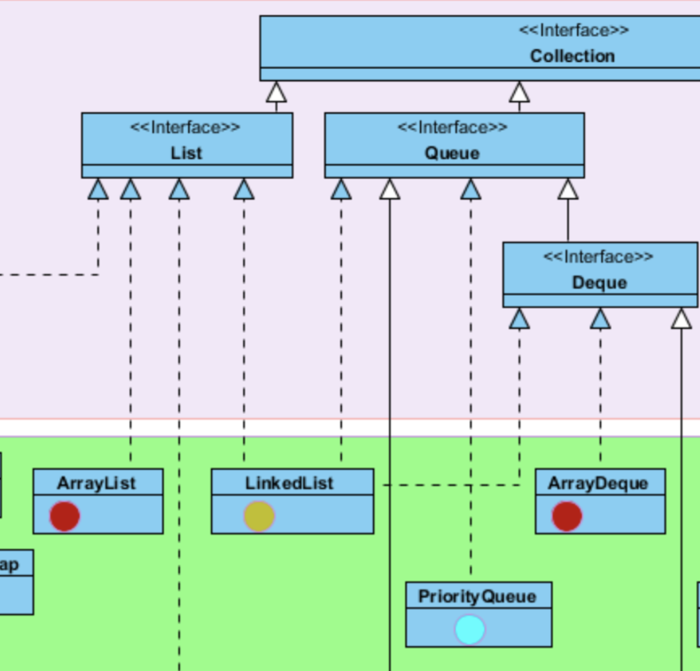

# LinkedList

# 开头

截取了一张图来说明一下`LinkedList`的实现关系



*LinkedList*同时实现了***List*接口**和***Deque*接口**，也就是说它既可以看作一个顺序容器，又可以看作一个队列(*Queue*)，同时又可以看作一个栈(*Stack*)。当你需要使用栈或者队列时，可以考虑使用*LinkedList*，关于栈或队列，现在的首选是*ArrayDeque*，它有着比*LinkedList*(当作栈或队列使用时)有着更好的性能。

# LinkedList的实现

## 底层数据结构


LinkedList的底层是通过**双向链表**实现的

通过`first`和`last`分别引用指向链表的`第一个`和最后一个元素

当链表为空时，`first`和`last`分别引用指向`null`

```java
transient int size = 0;

    transient Node<E> first;

    transient Node<E> last;

```

其中，node是其中的一个内部私有类

```java
private static class Node<E> {
        E item;
        Node<E> next;
        Node<E> prev;

        Node(Node<E> prev, E element, Node<E> next) {
            this.item = element;
            this.next = next;
            this.prev = prev;
        }
    }
```

*LinkedList*的实现方式决定了所有跟下标相关的操作都是线性时间，而在首段或者末尾删除元素只需要常数时间。

为追求效率*LinkedList*没有实现同步（synchronized），如果需要多个线程并发访问，可以先采用`Collections.synchronizedList()`方法对其进行包装。

## 构造函数

```java
  
    public LinkedList() {
    }

    public LinkedList(Collection<? extends E> c) {
        this();
        addAll(c);
    }
```


## 方法解析

### add()

这一个是默认插在链表的最后

```java
  public boolean add(E e) {
        linkLast(e);
        return true;
    }
```

```java
/**
 * Links e as last element.
 */
void linkLast(E e) {
    final Node<E> l = last;
    final Node<E> newNode = new Node<>(l, e, null);
    last = newNode;
    if (l == null)
        first = newNode;
    else
        l.next = newNode;
    size++;
    modCount++;
}
```


这一个是根据索引插入

```java
public void add(int index, E element) {
  	//这一步是检查插入索引位置是否符合要求
  	//判断index是否在[0，size]区间内
    checkPositionIndex(index);

  	//当插入索引位置在最后时，直接插入最后
    if (index == size)
        linkLast(element);
    else
      	//添加的元素索引位置不在最后时
        linkBefore(element, node(index));
}
```

关于`node(int index)`

返回指定索引下的node，该链表为双向的，根据`index < (size >> 1)`来判断index靠近前端还是后端，可以看出，LinkedList查找的效率并没有ArrayList高（LinkedList是线性的时间长度）

```java
 Node<E> node(int index) {
        // assert isElementIndex(index);

        if (index < (size >> 1)) {
            Node<E> x = first;
            for (int i = 0; i < index; i++)
                x = x.next;
            return x;
        } else {
            Node<E> x = last;
            for (int i = size - 1; i > index; i--)
                x = x.prev;
            return x;
        }
    }
```

现在我们来看看 `linkBefore(element, node(index))`

```java
/**
 * Inserts element e before non-null Node succ.
 */
void linkBefore(E e, Node<E> succ) {
    // assert succ != null;
  	// 
    final Node<E> pred = succ.prev;
  	//
    final Node<E> newNode = new Node<>(pred, e, succ);
    succ.prev = newNode;
    if (pred == null)
        first = newNode;
    else
        pred.next = newNode;
    size++;
    modCount++;
}
```


### addAll()

不加索引位置时，默认添加至最后，调用`addAll(int index, Collection<? extends E> c)`方法

```java
 public boolean addAll(Collection<? extends E> c) {
        return addAll(size, c);
    }

```


按照索引位置插入

```java
   public boolean addAll(int index, Collection<? extends E> c) {
        checkPositionIndex(index);

        Object[] a = c.toArray();
        int numNew = a.length;
        if (numNew == 0)
            return false;

        Node<E> pred, succ;
        if (index == size) {
            succ = null;
            pred = last;
        } else {
            succ = node(index);
            pred = succ.prev;
        }

        for (Object o : a) {
            @SuppressWarnings("unchecked") E e = (E) o;
            Node<E> newNode = new Node<>(pred, e, null);
            if (pred == null)
                first = newNode;
            else
                pred.next = newNode;
            pred = newNode;
        }

        if (succ == null) {
            last = pred;
        } else {
            pred.next = succ;
            succ.prev = pred;
        }

        size += numNew;
        modCount++;
        return true;
    }
```


### remove()

删除出现的第一个元素，如果没有，则返回null，由于LinkedList也可以存null，因此，也可以删除第一次出现的null元素

```java
public boolean remove(Object o) {
        if (o == null) {
            for (Node<E> x = first; x != null; x = x.next) {
                if (x.item == null) {
                    unlink(x);
                    return true;
                }
            }
        } else {
            for (Node<E> x = first; x != null; x = x.next) {
                if (o.equals(x.item)) {
                    unlink(x);
                    return true;
                }
            }
        }
        return false;
    }
```

```java
    /**
     * Unlinks non-null node x.
     */
    E unlink(Node<E> x) {
        // assert x != null;
        final E element = x.item;
        final Node<E> next = x.next;
        final Node<E> prev = x.prev;

      	//第一个元素时
        if (prev == null) {
            first = next;
        } else {
            prev.next = next;
            x.prev = null;
        }

      	//最后一个元素时
        if (next == null) {
            last = prev;
        } else {
            next.prev = prev;
            x.next = null;
        }

      	// null
        x.item = null;
        size--;
        modCount++;
        return element;
    }
```


删除指定索引的node

```java
public E remove(int index) {
        checkElementIndex(index);
        return unlink(node(index));
    }
```


> ### removeFirest(), removeLast()同比，就不放出来了

### clear()

清空引用关系，方便gc快速回收

```java
public void clear() {
        // Clearing all of the links between nodes is "unnecessary", but:
        // - helps a generational GC if the discarded nodes inhabit
        //   more than one generation
        // - is sure to free memory even if there is a reachable Iterator
        for (Node<E> x = first; x != null; ) {
            Node<E> next = x.next;
            x.item = null;
            x.next = null;
            x.prev = null;
            x = next;
        }
        first = last = null;
        size = 0;
        modCount++;
    }
```

## 关于modCount

LinkedList虽然是线程不安全的，但是也有快速失败的机制，通过记录`modCount`参数来实现。(同比参考ArrayList)


> 参考
>
> - Java LinkedList源码剖析 结合源码对LinkedList进行讲解 http://www.cnblogs.com/CarpenterLee/p/5457150.html
>
> - Java™ Platform, Standard Edition 8 API Specification