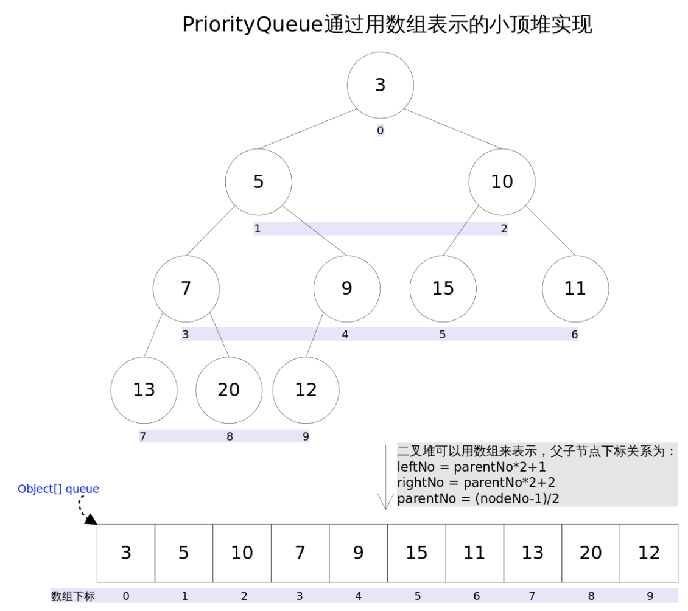
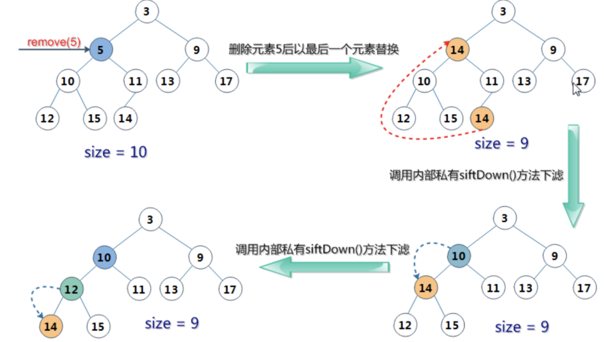

# PriorityQueue解读

> 今天复习了一下排序算法，在看到`堆排序`时无意想到还有个`PriorityQueue`没写🤣
>
> ⚠️该解读是基于JDK8版本，我在翻阅其他博客的时候发现JDK7在一些**无伤大雅**的地方有所不同

废话不多说，开冲！

PriorityQueue(优先队列)内部基于**数组**实现了一个**最大(小)堆**，保证每次取出的元素都是队列中**值最大(小)**的，其实现了Queue接口，继承AbstractQueue，不允许放入null值


Java默认构造的是**小顶堆**，如果需要构造**大顶堆**则需要在构造时传入一个**构造器**实现


## 前言

> 这里简单介绍一下如何用数组来实现完全二叉树：
>
> - 左子树(数组下标) = 父节点(数组下标) * 2 + 1
> - 右子树(数组下标) = 父节点(数组下标) * 2 + 2
> - 父节点(数组下标) = (子节点(数组下标) - 1) / 2
>
> 


## 内部属性

朴实无华的默认数组对象

```java
transient Object[] queue; // non-private to simplify nested class access
```


朴实无华的默认大小为`11`

```java
private static final int DEFAULT_INITIAL_CAPACITY = 11;
```


朴实无华的比较器

```Java
private final Comparator<? super E> comparator;
```


## 构造方法

下面四种是比较常用的构造方法

#### 无参构造

```java
public PriorityQueue() {
    this(DEFAULT_INITIAL_CAPACITY, null);
}
```


#### 指定容量构造

```java
public PriorityQueue(int initialCapacity) {
    this(initialCapacity, null);
}
```


#### 指定比较器构造

```java
public PriorityQueue(Comparator<? super E> comparator) {
    this(DEFAULT_INITIAL_CAPACITY, comparator);
}
```


#### 指定容量+比较器构造

```java
public PriorityQueue(int initialCapacity,
                     Comparator<? super E> comparator) {
    // Note: This restriction of at least one is not actually needed,
    // but continues for 1.5 compatibility
    if (initialCapacity < 1)
        throw new IllegalArgumentException();
    this.queue = new Object[initialCapacity];
    this.comparator = comparator;
}
```

> 还可以通过传入集合对象来构造，这里不做赘述


## 常用方法

### 添加元素

`add()`

```java
public boolean add(E e) {
    return offer(e);
}
```

`offer()`

```java
public boolean offer(E e) {
    if (e == null)
        throw new NullPointerException();
    modCount++;
    int i = size;
    if (i >= queue.length)
      	// 扩容操作
        grow(i + 1);
    size = i + 1;
    if (i == 0)
        queue[0] = e;
    else
      	// 添加元素操作
        siftUp(i, e);
    return true;
}
```


按照顺序来，先看看扩容算法

```java
private void grow(int minCapacity) {
    int oldCapacity = queue.length;
    // Double size if small; else grow by 50%
  	// 旧容量小于64则每次 容量翻倍+2
  	// 旧容量大于64则每次 容量增加50%
    int newCapacity = oldCapacity + ((oldCapacity < 64) ?
                                     (oldCapacity + 2) :
                                     (oldCapacity >> 1));
    // overflow-conscious code
  	// 判断是否会超出大小
    // 其中MAX_ARRAY_SIZE = Integer.MAX_VALUE - 8
    if (newCapacity - MAX_ARRAY_SIZE > 0)
        newCapacity = hugeCapacity(minCapacity);
  	// 类似ArrayList 再申请一个更大的数组，并将原数组的元素复制过去
    queue = Arrays.copyOf(queue, newCapacity);
}

private static int hugeCapacity(int minCapacity) {
    if (minCapacity < 0) // overflow
        throw new OutOfMemoryError();
    return (minCapacity > MAX_ARRAY_SIZE) ?
        Integer.MAX_VALUE :
        MAX_ARRAY_SIZE;
}
```


再看看添加元素算法

```java
private void siftUp(int k, E x) {
    if (comparator != null)
      	// 含有比较器
        siftUpUsingComparator(k, x);
    else
      	// 不含比较器
        siftUpComparable(k, x);
}

@SuppressWarnings("unchecked")
private void siftUpComparable(int k, E x) {
    Comparable<? super E> key = (Comparable<? super E>) x;
    ......
        if (key.compareTo((E) e) >= 0)
            break;
        ......
}

@SuppressWarnings("unchecked")
private void siftUpUsingComparator(int k, E x) {
    while (k > 0) {
        // 父节点(数组下标) = (子节点(数组下标) - 1) / 2
        int parent = (k - 1) >>> 1;
        Object e = queue[parent];
      	// 调用比较器方法
        if (comparator.compare(x, (E) e) >= 0)
            break;
        queue[k] = e;
        k = parent;
    }
    queue[k] = x;
}
```

考虑到新加入元素可能会破坏**大(小)顶堆**的性质，故从**下标k**开始(或者说是数组元素的最右端)，依次与该点父节点作比较并交换，直到满足`key.compareTo((E) e) >= 0`或`comparator.compare(x, (E) e) >= 0`为止，


### 获取元素

按照大(小)顶堆的性质，每次获取的元素都为堆顶元素(数组最左端/下标为0)

`Peek()`

```Java
public E peek() {
    return (size == 0) ? null : (E) queue[0];
}
```


### 移除元素

`poll()` 移除并返回堆顶元素

```java
public E poll() {
    if (size == 0)
        return null;
    int s = --size;
    modCount++;
  	// 标记堆顶，用于后续返回该元素
    E result = (E) queue[0];
  	// 记录数组最右元素
    E x = (E) queue[s];
  	// 赋null
    queue[s] = null;
    if (s != 0)
      	// 维护堆
        siftDown(0, x);
    return result;
}
```


堆维护 算法

```java
private void siftDown(int k, E x) {
    if (comparator != null)
      	//含比较器
        siftDownUsingComparator(k, x);
    else
        // 不含比较器
        siftDownComparable(k, x);
}

@SuppressWarnings("unchecked")
private void siftDownComparable(int k, E x) {
    Comparable<? super E> key = (Comparable<? super E>)x;
    ......
        if (right < size &&
            ((Comparable<? super E>) c).compareTo((E) queue[right]) > 0)
            c = queue[child = right];
        if (key.compareTo((E) c) <= 0)
            break;
        .......
}

@SuppressWarnings("unchecked")
private void siftDownUsingComparator(int k, E x) {
    int half = size >>> 1;
    while (k < half) {
      	// 左子节点 下标
        int child = (k << 1) + 1;
      	// 记录节点元素值
        Object c = queue[child];
      	// 右子节点 下标
        int right = child + 1;
      	// 比较子节点中较小的那个(小顶堆)
        if (right < size &&
            comparator.compare((E) c, (E) queue[right]) > 0)
            c = queue[child = right];
        if (comparator.compare(x, (E) c) <= 0)
            break;
        queue[k] = c;
        k = child;
    }
    queue[k] = x;
}
```

移除元素流程：

- 标记堆顶 用于后续返回元素
- 将**数组下标最大元素**(即便完全二叉树最下层、最右边的节点)放置堆顶
- 通过堆顶元素与子节点的交换 维护堆
    - 维护小顶堆则 交换 较小的子节点
    - 维护大顶堆则 交换 较大的子节点


`remove(Object 0)` 删除堆中某一指定元素，若有多个则只删除一个

删除中间某个节点的话无疑会`破坏堆的性质`,故还需要维护

```java
public boolean remove(Object o) {
    // 获取元素对应数组下标
    int i = indexOf(o);
    if (i == -1)
        return false;
    else {
        removeAt(i);
        return true;
    }
}
private E removeAt(int i) {
        // assert i >= 0 && i < size;
        modCount++;
  			// 如果删除元素为最后一个
  			// 则直接删除后 无需维护堆
        int s = --size;
        if (s == i) // removed last element
            queue[i] = null;
        else {
          	// 若元素不为最后一个
          	// 将最后一个元素插入到i位置
          	// 然后通过siftDown()和siftUp()来调整位置
            E moved = (E) queue[s];
            queue[s] = null;
            siftDown(i, moved);
            if (queue[i] == moved) {
                siftUp(i, moved);
                if (queue[i] != moved)
                    return moved;
            }
        }
        return null;
    }
```

这里找来一张图来理解一下：




> 参考自：https://www.cnblogs.com/CarpenterLee/p/5488070.html

