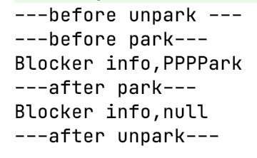

# 谈谈 LockSupport类

`LockSupport`提供**创建锁**和其他同步类的**基本线程阻塞**功能

`LockerSupport`的核心函数功能**基于**`UNSAFE`类提供的park()、unpark()函数

- `park()`：阻塞线程，发生阻塞后，可以有以下几种情况可以唤醒线程
  - 该线程被调用`unpark()`
  - 该线程被中断，如`thread.interrupt()`
  - 该线程`park()`中设置的时间到了
- `unpark()`：释放线程

### LockSupport.park()

```java
public static void park(Object blocker) {
  			// 获取当前线程
        Thread t = Thread.currentThread();
  			// 设置Blocker
        setBlocker(t, blocker);
  			// 调用UNSAFE.park阻塞线程
  			// 设置时间为无限长，直到可以获取许可
        UNSAFE.park(false, 0L);
  			// 线程释放后，执行此步，设置Blocker为null
        setBlocker(t, null);
    }
```

### LockSupport.unpark()

直接调用`UNSAFE.unpark(thread)`

```java
public static void unpark(Thread thread) {
        if (thread != null)
            UNSAFE.unpark(thread);
    }
```


### 测试代码

```java
class MyThread extends Thread {
    private Object object;

    public MyThread(Object object){
        this.object = object;
    }

    public void run(){
        System.out.println("---before unpark ---");

        try {
            Thread.sleep(1000);
        } catch (InterruptedException e) {
            e.printStackTrace();
        }
        // 获取blocker
        System.out.println("Blocker info," + LockSupport.getBlocker((Thread) object));
        // 释放
        LockSupport.unpark((Thread) object);
        try {
            // 保证执行 park中的serBlocker(t,null)
            Thread.sleep(1000);
        } catch (InterruptedException e) {
            e.printStackTrace();
        }
        // 再次获取blocker
        System.out.println("Blocker info," + LockSupport.getBlocker((Thread) object));

        System.out.println("---after unpark---");
    }
}

public class ParkTest {
    public static void main(String[] args) {
        MyThread myThread = new MyThread(Thread.currentThread());
        myThread.start();
        System.out.println("---before park---");
        // 获取许可
        LockSupport.park("PPPPark");
        System.out.println("---after park---");
    }
}
```

结果：




可以看到`park()`前后 **blocker**的值分别为**自己设定的值**、**null**，验证了前面说明的`LockSupport.unpark()`函数内两次`setBlocker(t, null)`.


## Others

> 若提前调用LockSupport.unpark() 然后再调用LockSupport.park()，则等于是该线程提前拿到了“通行证”，不会因为顺序不当引起阻塞，仍能够正确实现同步。

> 相比于wait、notify的方式更加灵活

