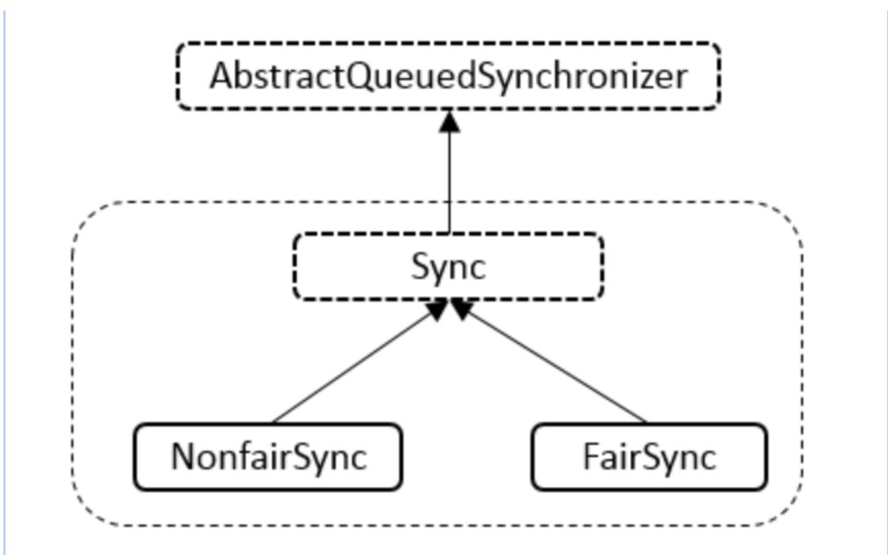

# 谈谈ReentrantLock的基础实现

> 之前一直对ReentrantLock的底层实现有些迷迷糊糊，昨天自己尝试简单写了一个锁之后，才恍然大悟，今天也来看看ReentrantLock

## ReentrantLock

也被称为可重入锁，内部类结构如下：



Sync类继承自AbstractQueuedSynchronizer(下面简称为AQS)抽象类，内部**基于计数器**实现了**可重入**这一功能

而NonfairSync和FairSync则是继承Sync类，在可重入的功能上，具有了**公平锁**和**不公平锁**的功能

## 可重入(Sync类)的基本实现

了解AQS的同学一定对这两个方法很熟悉

下面通过注释来讲一讲**可重入**这一概念是如何实现的

> **默认**实现了非公平锁(nonfair)。。。这对公平锁来说真的是不公平呀！

```java
// 获取资源操作(加锁)
final boolean nonfairTryAcquire(int acquires) {
  					// 获取当前线程
            final Thread current = Thread.currentThread();
  					// 获取状态  
            int c = getState();
  					// 0表示没有线程竞争时 尝试加锁
            if (c == 0) {
              	// 比较并设置状态 基于Unsafe包CAS的支持
                if (compareAndSetState(0, acquires)) {
                  	// 设置该资源为当前线程独占
                    setExclusiveOwnerThread(current);
                    return true;
                }
            }
  					// 当线程 已经拥有该锁了--重点！
            else if (current == getExclusiveOwnerThread()) {
              	// 增加重入次数
                int nextc = c + acquires;
                // 超出int范围
                if (nextc < 0) 
                    throw new Error("Maximum lock count exceeded");
              	// 设置新的状态
                setState(nextc);
                // 重入操作成功
                return true;
            }
  					// 失败
            return false;
        }

// 以独占模式释放资源操作(解锁)
protected final boolean tryRelease(int releases) {
            int c = getState() - releases;
  					// 当前线程不为独占线程 抛出异常
            if (Thread.currentThread() != getExclusiveOwnerThread())
                throw new IllegalMonitorStateException();
            boolean free = false;
  					// 当状态为0(可重入次数为0) 释放资源
            if (c == 0) {
                free = true;
              	// 设置独占资源线程为null(释放资源)
                setExclusiveOwnerThread(null);
            }
  					// 当状态不为0时，可重入次数降低
            setState(c);
            return free;
        }
```


## 非公平锁(NofairSync)的实现

基于上面的代码注释论述，这里没什么可讲的

主要实现了Sync类中抽象的lock方法

```java
static final class NonfairSync extends Sync {
        private static final long serialVersionUID = 7316153563782823691L;

        // 加锁操作
        final void lock() {
            if (compareAndSetState(0, 1))
                setExclusiveOwnerThread(Thread.currentThread());
            else
              	// 独占模式获取资源 忽略中断
                acquire(1);
        }

        protected final boolean tryAcquire(int acquires) {
            return nonfairTryAcquire(acquires);
        }
    }
```


## 公平锁(FairSync)的实现

公平锁的实现主要是判断AQS中的**sync队列**是否有**等待时间更长**的线程，如果存在，则将线程放入**队列尾部排队**，即下列代码中的`hasQueuePredecessors()`

其中`lock()`方法也与公平锁不同

- 非公平锁会先尝试获取资源，失败后再执行`acquire(1)`
- 公平锁则直接执行`acquire(1)`

这里的`acquire(1)`是AQS内的方法

尝试获取资源失败则加入等待队列

```java
public final void acquire(int arg) {
        if (!tryAcquire(arg) &&
            acquireQueued(addWaiter(Node.EXCLUSIVE), arg))
            selfInterrupt();
    }
```

其他步骤实现和非公平锁一样

```java
static final class FairSync extends Sync {
        private static final long serialVersionUID = -3000897897090466540L;

        final void lock() {
            acquire(1);
        }
				// 尝试公平获取资源
        protected final boolean tryAcquire(int acquires) {
            final Thread current = Thread.currentThread();
            int c = getState();
            if (c == 0) {
              	// 不存在等待更久的线程 且 CAS成功
                if (!hasQueuedPredecessors() &&
                    compareAndSetState(0, acquires)) {
                  	// 设置该资源为当前线程独占
                    setExclusiveOwnerThread(current);
                    return true;
                }
            }
            else if (current == getExclusiveOwnerThread()) {
                int nextc = c + acquires;
                if (nextc < 0)
                    throw new Error("Maximum lock count exceeded");
                setState(nextc);
                return true;
            }
            return false;
        }
    }
```


## 总结

ReentrantLock的操作总结下来都会转换为对Sync的操作，而Sync也是继承自AQS，背后是AQS(Unsafe)提供了支持


**公平锁**和**非公平锁**的实现也是转换为对与AQS的操作(重写以达到定制锁的目的)


> 可重入锁在默认没声明的前提下 实现的是非公平锁
>
> ```java
> public ReentrantLock(boolean fair) {
>         sync = fair ? new FairSync() : new NonfairSync();
>     }
> ```

