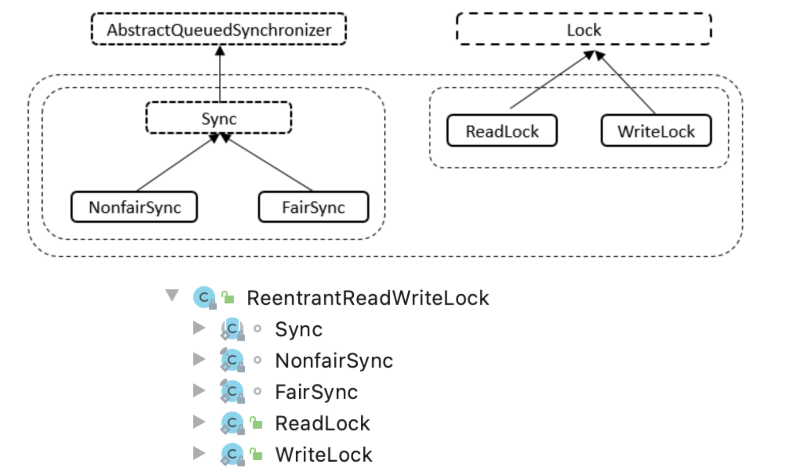

# 谈谈ReentrantReadWriteLock的基础实现

## ReentrantReadWriteLock

这个名字长长的锁叫 **可重入** **读写锁**，可以简单认为是在**可重入**锁的基础上 实现了读写锁的功能。

看看其内部结构 如下图所示：




实现起来也比可重入锁复杂一些

阅读的时候带着一个问题：

- **读/写**如何实现、配合使用
- **读/写**操作如何与**可重入**配合使用

下面一个个类来讲，看看**可重入读写锁**是怎么实现的：


## Sync类

这个类是老朋友了，继承自AQS

下面先来看看可重入Sync中的内部类

### HoldCounter类（Sync内部类）

看源码注释可以知道，其与**读锁**配套使用，读线程计数器

```java
				/**
         * A counter for per-thread read hold counts.
         * Maintained as a ThreadLocal; cached in cachedHoldCounter
         */
        static final class HoldCounter {
          	// 记录读线程重入的次数
            int count = 0;
            // Use id, not reference, to avoid garbage retention
          	// 获取当前线程的唯一标识属性
            final long tid = getThreadId(Thread.currentThread());
        }
```


### ThreadLocalHoldCounter类（Sync内部类）

```java
// 本地线程计数器
static final class ThreadLocalHoldCounter
            extends ThreadLocal<HoldCounter> {
  					// 重写初始化方法 默认获取HoldCounter()的返回值 conut
            public HoldCounter initialValue() {
                return new HoldCounter();
            }
        }
```


### Sync类属性

重点！后续会用到！

关于命名

- 读锁可以看作是共享锁，广义上来说，单纯的读操作并不会造成数据的一致性不同，即多个线程看到的数据都是同一个，故可以用SHAERED(分享)表示

- 写锁可以看作是独占锁，写操作需要独占该线程，修改资源数据后方可给其他线程使用(不论是读/写操作)，故可以使用EXCLUSIVE(独占)表示

```java
abstract static class Sync extends AbstractQueuedSynchronizer {
  			// 序列化版本号
        private static final long serialVersionUID = 6317671515068378041L;
  			// 读锁高16位 写锁低16位置
        static final int SHARED_SHIFT   = 16;
  			// 读锁单位，左移16位表示 读锁位于高16位
        static final int SHARED_UNIT    = (1 << SHARED_SHIFT);
  			// 读锁最大数量
        static final int MAX_COUNT      = (1 << SHARED_SHIFT) - 1;
  			// 写锁最大数量
        static final int EXCLUSIVE_MASK = (1 << SHARED_SHIFT) - 1;
				// 用于本地线程计数
        private transient ThreadLocalHoldCounter readHolds;
  			// 用于缓存计数
  			private transient HoldCounter cachedHoldCounter;
  			// 第一个读线程
   			private transient Thread firstReader = null;
  			// 第一个读线程计数
        private transient int firstReaderHoldCount;
```


### Sync核心函数部分

> 我们知道**FairSyncNonFairSync**类都继承自Sync类，而Sync则通过重写了AQS中的**模版方法**来达到定制锁的目的，故Sync类的核心函数是一个锁的**灵魂**所在。

下面来看看Sync核心函数，看看对读写锁的实现有没有一些明悟：

#### sharedCount()

获得**读线程的数量**(读锁位于高16位置)，状态数右移16位

```java
static int sharedCount(int c)    { return c >>> SHARED_SHIFT; }
```

#### exclusiveCount()

获得**写线程数量**，状态数字(2^16 - 1)做&运算，等于将状态数与2^16取模操作，目的是获取低16位的写数量

```
static int exclusiveCount(int c) { return c & EXCLUSIVE_MASK; }
```


#### tryAcquire()

> 写锁的lock()方法会调用该函数

独占模式获取资源，重写AQS中的模版方法，既然是独占模式，则该函数是用于 **写锁的获取**

```java
protected final boolean tryAcquire(int acquires) {
    // 获取当前线程
    Thread current = Thread.currentThread();
  	// 获取状态数
    int c = getState();
  	// 写线程数量
    int w = exclusiveCount(c);
  	// 状态不为0 则该资源已被占用
    if (c != 0) {
      	// 当写线程为0 且当前线程并没有独占资源 -> 说明该线程被 读线程 共享，则返回false
        if (w == 0 || current != getExclusiveOwnerThread())
            return false;
      	// 写线程超过最大数量时，抛出异常
        if (w + exclusiveCount(acquires) > MAX_COUNT)
            throw new Error("Maximum lock count exceeded");
        // 否则设置AQS可重入状态数，这里说明 写线程重入
        setState(c + acquires);
        return true;
    }
  	// 当状态为0 则该资源未被占用
  	// writerShouldBlock()判断是否应该被阻塞
  	// NonfairSync下writerShouldBlock()总不会被阻塞，因为它是不公平的、不需要排队
  	// FairSync下会使用hasQueuedPredecessors()判断是否会有等待时间更长的线程，有 则需要被阻塞，没有则不会被阻塞
    if (writerShouldBlock() ||
        !compareAndSetState(c, c + acquires))
        return false;
  	// 设置独占线程
    setExclusiveOwnerThread(current);
    return true;
}
```

这里有一张流程图，来更好的理解这个过程：


自己的话总结一下：

- 当该资源已经被占用时，分两个情况
    - 读线程占用，返回false(写操作会影响读操作的数据一致性)
    - 写线程占用，则进行可重入操作(等待上一个写线程完成后到自己)
- 当该线程未被占用时，根据公平/非公平锁判断是否需要阻塞(排队)
    - 公平锁：则调用AQS中方法`hasQueuedPredecessors()`，判断是否有等待时间更长的线程，在
        - 有，则阻塞(排队)
        - 无，则返回false(无需阻塞)，并进行后面的CAS操作
    - 非公平锁，`hasQueuedPredecessors()`直接返回false，进行后续的设置独占线程操作


#### tryRelease()

> 写锁的`unlock()`方法会调用该方法

独占模式释放资源，重写AQS中的模版方法，用于表示**写线程释放资源操作**

```java
protected final boolean tryRelease(int releases) {
  	// 判断该线程是否为独占线程
    if (!isHeldExclusively())
        throw new IllegalMonitorStateException();
  	// 计算释放资源后 写锁数
    int nextc = getState() - releases;
    boolean free = exclusiveCount(nextc) == 0;
  	// 若为0则成功释放资源
    if (free)
        setExclusiveOwnerThread(null);
  	// 不为0则继续进行可重入的写操作
    setState(nextc);
    return free;
}
```

这里可以认为当有多个写锁排队阻塞线程时候，会一个个进行写操作(独占模式)，则表示资源尚未释放

当写锁数量为0时，表示资源已经被释放(**读锁并不会以独占模式使用线程)**


#### tryAcquireShared()

> 读锁的`lock()`方法最终会调用到该方法

注意⚠️：该方法返回的值为 **整数**

- 返回 **-1** 表示失败
    - **-1** 时，会调用AQS中的`doAcquireShared()`方法，此时该失败线程会进入一个阻塞队列里，进行资源的排队尝试获取/排队
- 返回 **1** 表示成功获取

共享模式获取资源，重写AQS中的模版方法，用于表示**读线程获取资源操作**

```java
protected final int tryAcquireShared(int unused) {
  	// 获取当前线程
    Thread current = Thread.currentThread();
  	// 获取状态数
    int c = getState();
  	// 写线程不为0 且占有资源的不是当前线程时 
    if (exclusiveCount(c) != 0 &&
        getExclusiveOwnerThread() != current)
        return -1;
  	// 读锁数量
    int r = sharedCount(c);
  	// 读线程是否被阻塞 且 读锁数量小于最大数量 且 CAS操作成功(读锁+1)
    if (!readerShouldBlock() &&
        r < MAX_COUNT &&
        compareAndSetState(c, c + SHARED_UNIT)) {
      	// 当读锁数量为0时
        if (r == 0) {
          	// 设置第一个读线程为当前线程
            firstReader = current;
          	// 该线程占用资源为1
            firstReaderHoldCount = 1;
         // 当第一个读线程为当前线程
        } else if (firstReader == current) {
          	// 该线程占用资源为+1(可重入)
            firstReaderHoldCount++;
          // 读锁数量不为0 且 不为当前线程
        } else {
          	// 获取计数器
            HoldCounter rh = cachedHoldCounter;
          	// 计数器为空 或 当前线程运行线程 不为 计数器对应的tid
            if (rh == null || rh.tid != getThreadId(current))
              	// 获取当前线程计数器(缓存)
                cachedHoldCounter = rh = readHolds.get();
            // 计数器为0时
            else if (rh.count == 0)
              	// 设置本地线程计数
                readHolds.set(rh);
          	// 计数
            rh.count++;
        }
        return 1;
    }
    return fullTryAcquireShared(current);
}
```


### tryReleaseShared()

> 读锁的unlock()操作会调用该方法

共享模式获取资源，重写AQS中的模版方法，用于表示**读线程释放资源操作**

```Java
protected final boolean tryReleaseShared(int unused) {
  	// 获取当前线程
    Thread current = Thread.currentThread();
  	// 第一个读线程为该线程时
    if (firstReader == current) {
        // 读线程计数器为1时，完全释放资源
        if (firstReaderHoldCount == 1)
            firstReader = null;
        else
          	// 读线程计数器不为1，计数器-1
            firstReaderHoldCount--;
      // 当前线程不为第一个线程
    } else {
      	//获取缓存计数器(上一个读线程计数器)
        HoldCounter rh = cachedHoldCounter;
      	// 计数器为空 或 当前线程运行线程 不为 计数器对应的tid
        if (rh == null || rh.tid != getThreadId(current))
          	// 获取当前线程的计数器
            rh = readHolds.get();
      	// 获取计数
        int count = rh.count;
      	// 计数小于等于1时，移除
        if (count <= 1) {
            readHolds.remove();
          	// 抛出异常
            if (count <= 0)
                throw unmatchedUnlockException();
        }
      	// 缓存计数器减少计数
        --rh.count;
    }
  	// 无限循环
    for (;;) {
       	// 获取状态
        int c = getState();
      	// 获取读锁 -1 后的值
        int nextc = c - SHARED_UNIT;
        // 尝试进行CAS
        if (compareAndSetState(c, nextc))
            return nextc == 0;
    }
}
```

