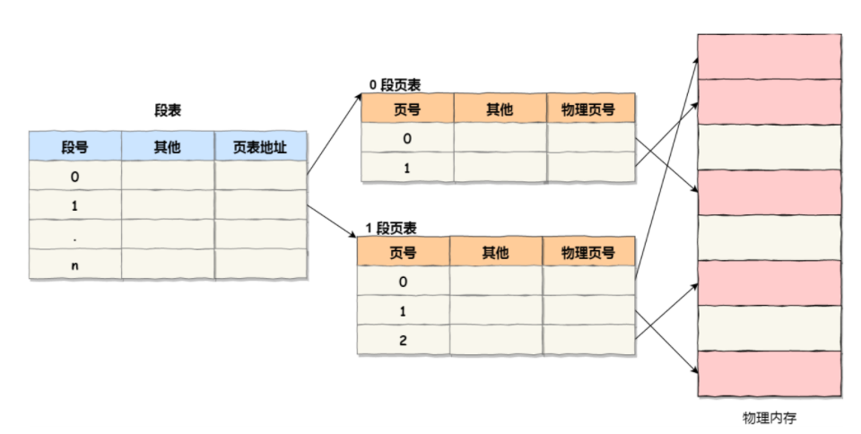
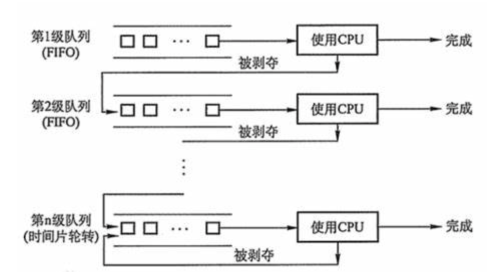
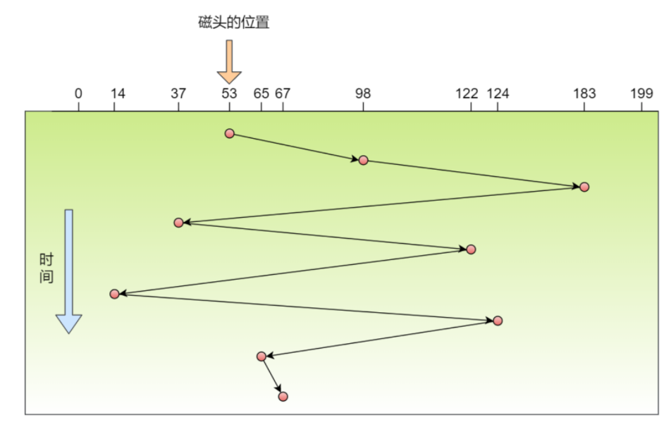
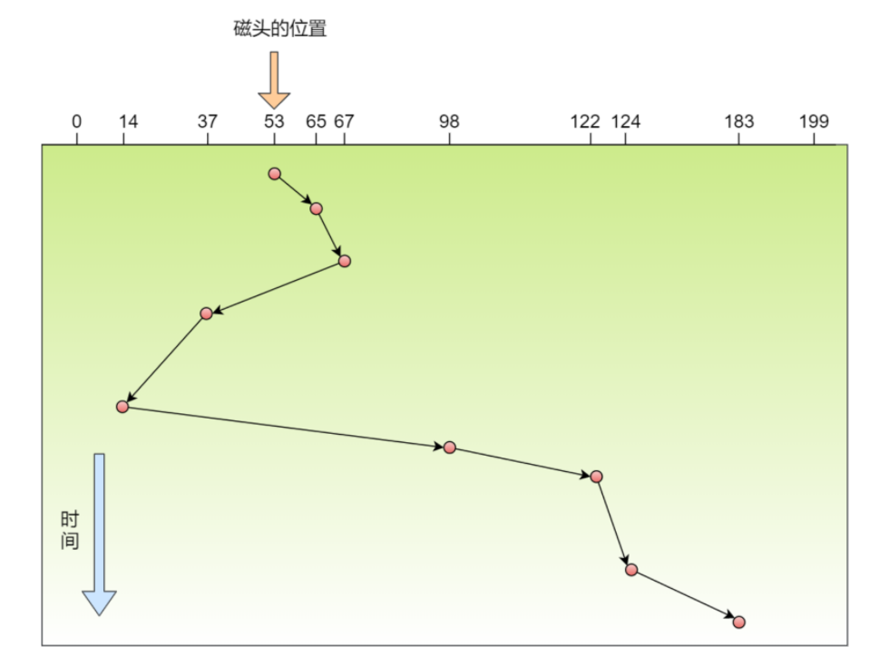
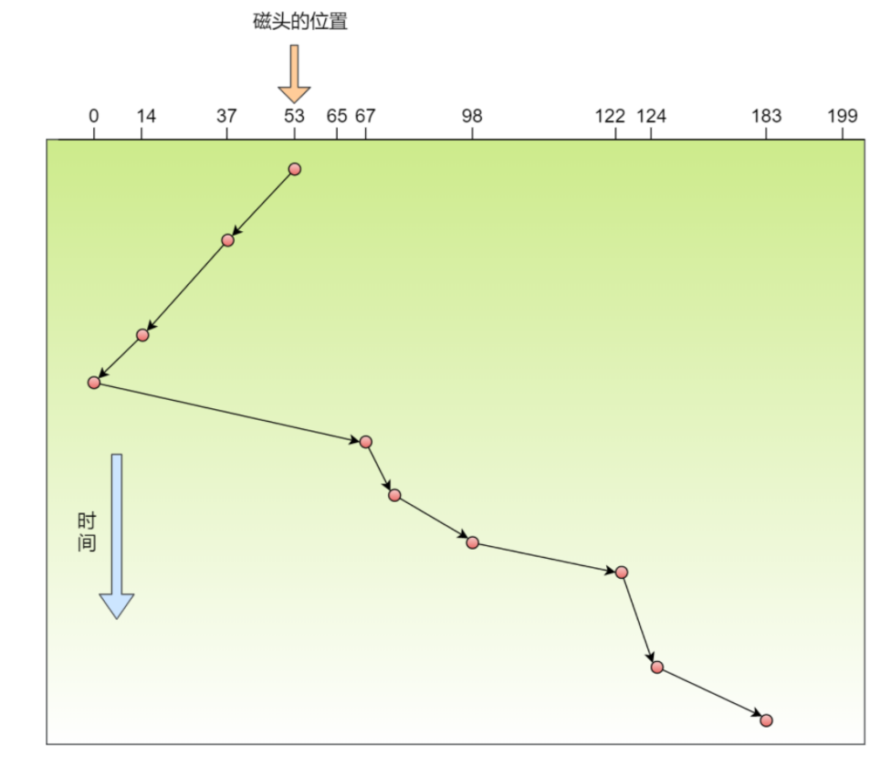
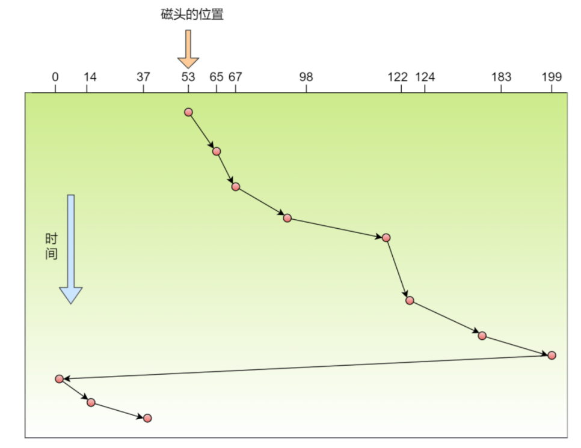

# 内存管理

### 内存分段

分段会产生内存碎片，以及内存交换的效率低的问题

#### 什么是内存交换呢？

- 分段式内存管理会产生一些内存碎片
    - 外部碎片->产生多个不连续的小内存
    - 内部碎片->程序**不常用**的内存也被装在到物理内存上

- 为了利用好这一部分的内存碎片（外部），可以把通过把程序**从内存读入硬盘**再从**硬盘重新读到内存**的方式，这一部分在硬盘上的空间就叫做内存交换空间

#### 为什么内存分段的内存交换率低呢？

- 频繁的交换可能会产生性能瓶颈

- 交换的程序占用内存比较大的时候，机器可能因为性能原因造成卡顿

---

### 内存分页

为了解决内存分段的问题

把内存空间切成固定尺寸（4kb，通常是512B～8KB）的连续空间（页）

通过**页表**来记录**页号**-->**实际物理块号**的**地址映射**

#### 怎么解决内存碎片和交换率低的问题呢？

- 内存碎片：内存分页的机制决定了不会产生无法利用的小内存
- 交换率低
    - 当程序加载时，物理内存只加载虚拟内存页里面**需要用到**的指令和数据（并不一次加载一个完整的程序）
    - 内存空间不够时，会将「不常用」的内存页给写入硬盘中（**释放**），需要用时再加载进来

### 段页式内存管理

将内存分段和内存分页组合起来一起使用

程序划分为多个有逻辑意义的段，再把每个段划分为多个页

于是地址结构由**段号**、**段内页号**、**页内位移**三部分组成

---

# 调度算法

### 进程调度算法

#### 先来先服务调度算法（**First Come First Severd, FCFS**）

略

#### 最短作业优先调度算法（**Shortest Job First, SJF**）

略

#### 高响应比优先调度算法（**Highest Response Ratio Next, HRRN**）

#### 时间片轮转调度算法（**Round Robin, RR**）

- 每个进程分配一个时间片，允许进程在该时间段中运行
    - 时间片用完，进程还在运行则切换另一个进程
    - 进程在时间片结束前阻塞或者结束，cpu切换另一个进程

#### 最高优先级调度算法（**Highest Priority First**，**HPF**）

> 从就绪队列中选择优先级最高的进程运行

进程的优先级可以分为，静态优先级和动态优先级：

- 静态优先级：进程创建时就已经确定了优先级，后续运行时间内无法改变
- 动态优先级：根据进程的动态变化调整优先级（如：随着时间的推移增加等待进程的优先级。）

处理优先级高的方法也分为，抢占式和非抢占式：

- 抢占式：就绪队列中出现优先级高的进程时，挂起当前进程，运行优先级高的进程
- 非抢占式：就绪队列中出现优先级高的进程时，运行完当前进程，再选择优先级高的进程

#### 多级反馈队列调度算法（**Multilevel Feedback Queue**）

结合了「时间片轮转调度」和「最高优先级调度」算法

先设置了多个队列，**高优先级队列**内的进程**优先被处理**，与此同时越高优先级队列所**分配的时间片也越短**

****

> ps:随便整了张图来体会体会

尝试通过举一个例子来阐述这种调度算法：

- **进程A**进入队列，此时没有进程在处理，将进程A放入最高优先级队列`Q1`中（**先来先服务**）
- 过一段时间后，**进程B**进入队列
    - 此时若**进程A**在队列`Q1`所规定的时间片内未运行完成，则将**进程A**放入次一级队列`Q2`等待运行（就绪状态）
    - 若**进程A**能在`Q1`所规定的时间片运行完成，则进程B进入`Q1`队列等待运行
- 再过一段时间后，**进程C**进入队列
    - 此时若**进程B**在`Q1`中运行，进程A在Q2中等待，则将**进程C**放入`Q1`队列中等待运行
    - 当进程B运行完成后，由于**进程C**所在的`Q1`队列优先级比进程A所在的`Q2`队列高，所以优先调度**进程C**运行

### 页面置换算法

不合理的页面置换算法会导致虚拟存储中出现**抖动现象**

- 内存页面在内外存之间被频繁的调入和调出，此时调度页面需要的时间比进程实际运行的时间还多，导致系统效率急剧下降
- 抖动的根本原因是分配给进程的物理页数过少

只考虑原因(不合理的算法)和结果(效率低下)的话，可以类似在进程调度中采用了不合理的调度算法，导致作业完成效率低下

#### 最佳置换(OPT)算法

一个理想派的算法，认为被淘汰的页面在以后永不使用(或很长一段时间内)

实现：

- 需要先计算内存中每个逻辑页面「下一次」访问时间，置换掉未来最长时间不访问的页面

例如在有限内存被7、0、1占用的情况下，计算出7是7、0、1中最长时间未被访问的物理页，则将其置换掉

> 该算法通常可以保证获得**最低**的缺页率，实际情况中无法预知`每个逻辑页面「下一次」访问时间`	则该算法值存在于理想情况中，同时也衡量其他页面置换算法效率

#### 先进先出(FIFO)置换算法

选择在内存中驻留最长的页面进行置换

实现：

- 通过一个指向最老页面的**替换指针**

缺点：

- 缺页率高，置换掉的页面未考虑实际情况

#### CLOCK(最近未用算法NRU)置换算法

> 这里先提一下 第二次机会置换 算法，该算法算是FIFO的优化
>
> 二次机会指 访问位为**1**的页面访问位会被清零 的情况(对于FIFO算法来说，被指针指到了，却因为访问位为1而活了下来 )
>
> 第二次机会置换算法 相比接下来的 NRU 置换算法，不同在于：
>
> - 前者为「单链表」，后者为「环形链表」
> - NRU提高了了 替换指针的效率

选择访问位为**0**的页面置换

实现：

- 页面有一个访问位来标志页面最近情况

- 内存中页面存入一个「环形链表」中，指针指向最老页面

    - 缺页中断时，指针遍历链表查找访问位为**0**的页面并置换掉

    - 访问位为**1**的页面访问位会被清零

缺点：我似乎并没有找到这种算法的缺点。。。(在一些资料中也没找到)

改进：

- 增添一个修改位来记录 页面修改情况，能对页面情况判断更细

  > 思考：有没有必要增添更多的xx位来记录页面的修改情况，以便更加准确的判断选择需要置换的页面

#### 最近最久未使用(LRU)置换算法

选择最⻓时间没有被使用(使用的情况包括新增、访问)的页面置换

实现：

- 通过维护一个所有页面的链表(最近被使用的页面在表头，最近未被使用的在表尾)

缺点：

- 每次访问内存时都需要更新「整个」链表，开销比较大

  > 很少有计算机系统能提供足够的硬件来支持真正的 LRU 页面置换算法。事实上，有些系统不提供硬件支持，并且必须使用其他页面置换算法（例如 FIFO 算法）。

#### 最不常用置换(LFU)算法

选择「访问次数」最少的那个页面置换

实现：

- 每个页面设置一个访问计数器，页面被访问的时候，计数器加一

缺点:

- 计数器成本较高
- 只考虑计数器的频率问题，当某一页面在很久之前被多次访问后，但是现在没有访问，可能会**误置换**掉现在访问次数较频繁的页面

解决：

- 通过某一自定规则 减少过去时间访问次数对现在的影响
    - 例如每隔一定时间将计数器的值 除二

### 磁盘调度算法

#### 先来先服务算法

先到来的请求先被服务

优点：

- 简单粗暴

缺点：

- 如果请求的磁道分散，则性能会比较差

#### 最短寻道时间有限算法

优先选择从当前磁头位置所寻道时间最短的请求(贪心的思想)

优点：

- 性能高于先来先服务算法

缺点：

- 动态请求下，可能会产生饥饿现象，即磁头在一小块区域内来回移动，对于一些**远一点**的磁道来说永远不会被响应

#### 扫描算法

磁头在一个方向上移动，访问所有未完成的请求，直到到该方向上的最后磁道，才调换方向

优点：

- 性能较好，不会产生饥饿现象，中间部分的磁道响应的频率会比较多

缺点：

- 上述所说，磁盘响应频率存在差异

#### 循环扫描算法

> 扫描算法优化

规定磁头只往一个特定方向移动，才处理磁道访问请求，访问至最边缘磁道后复位磁头(只响应一个方向上的请求)

优点：

- 响应频率比较平均

#### LOOK与C-LOOK算法

> 扫描算法优化
>
> 上述扫描至磁盘边缘磁头才复位
>
> 这两个算法当磁头移动至**最远请求位置**时就反向移动

LOOK算法对应的是扫描算法(反向途中会响应请求)

C-LOOK算法对应的是循环扫描算法(反向途中不会响应请求)

