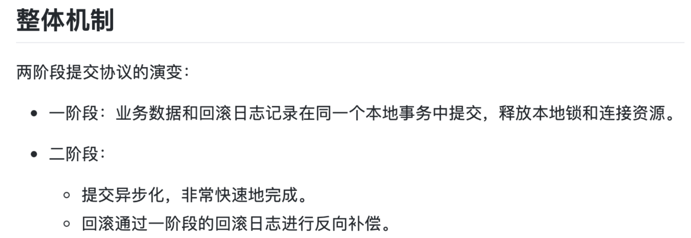
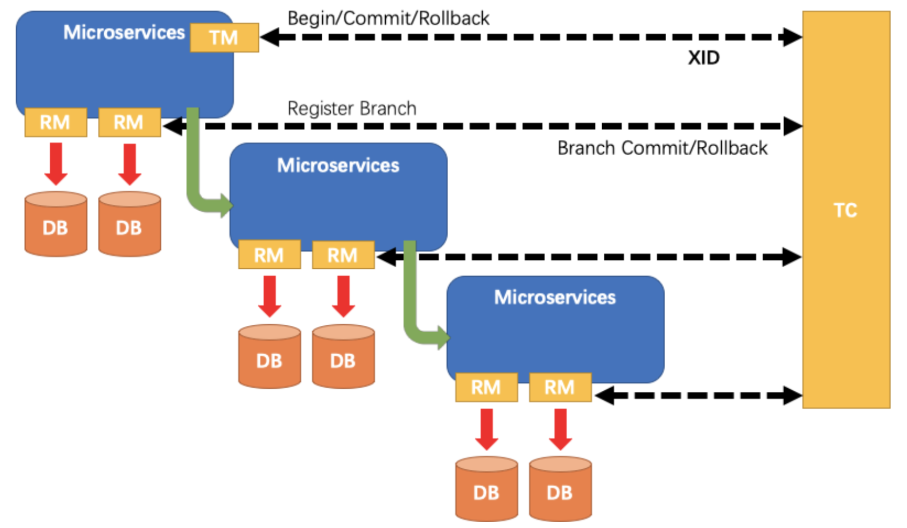
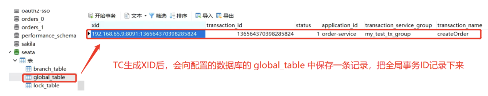
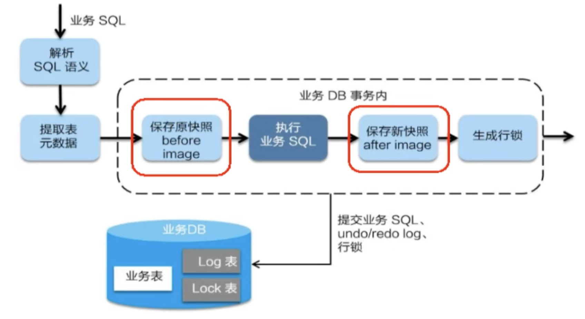

# 谈谈Seata的AT事务实现过程

> AT模式基于`XA`协议的`2PC`提交，其中Mysql等数据库本身支持XA分布式协议，内部都实现了XA接口

2PC也是一种**强一致性**的设计，因此使用下来性能较差(`CAP`嘛，莫得办法)

使用上来说，对于业务的侵入较小，对需要使用分布式的事务上添加一个`@GlobalTransactional`注解即可

> 吐槽一下：Seata官网的文档写的是真不能看。。。
>
> 
>
> 就这些？！！


## AT模式

AT模式下的一次分布式事务操作如图：



这里解释一些名词：

- TC：全局事务协调者 (体现为Seata服务器)
- TM：事务控制者/发起方 (一般为添加了`@GlobalTransactional`注解的方法上)
- RM：资源 (对应的是SQL语句)

该模式基于2PC协议，那么接下来的讲解也会按照二阶段提交来讲解


## 一阶段

### 1. 获取全局事务XID

```java
@ConditionalOnProperty(prefix = SEATA_PREFIX, name = "enabled", havingValue = "true", matchIfMissing = true)
public class SeataAutoConfiguration {
    private static final Logger LOGGER = LoggerFactory.getLogger(SeataAutoConfiguration.class);
    
	//失败处理类
    @Bean(BEAN_NAME_FAILURE_HANDLER)
    @ConditionalOnMissingBean(FailureHandler.class)
    public FailureHandler failureHandler() {
        return new DefaultFailureHandlerImpl();
    }
    
	//全局事务扫描器
    @Bean
    @DependsOn({BEAN_NAME_SPRING_APPLICATION_CONTEXT_PROVIDER, BEAN_NAME_FAILURE_HANDLER})
    @ConditionalOnMissingBean(GlobalTransactionScanner.class)
    public GlobalTransactionScanner globalTransactionScanner(SeataProperties seataProperties, FailureHandler failureHandler) {
        if (LOGGER.isInfoEnabled()) {
            LOGGER.info("Automatically configure Seata");
        }
        return new GlobalTransactionScanner(seataProperties.getApplicationId(), seataProperties.getTxServiceGroup(), failureHandler);
    }
}
```

Seata的逻辑入口是`SeataAutoConfiguration`类，其中注册了一个全局事务扫描器`GlobalTransactionScanner`用来全局扫描`@GlobalTransactional`注解

#### 1.1 本地RM、TM的初始化

其中,`GlobalTransactionScanner`扫描类实现了`InitializingBean`接口，其中在`afterPropertiesSet`方法中初始化了本地RM、PM

```java
private void initClient() {
        if (LOGGER.isInfoEnabled()) {
            LOGGER.info("Initializing Global Transaction Clients ... ");
        }
        if (StringUtils.isNullOrEmpty(applicationId) || StringUtils.isNullOrEmpty(txServiceGroup)) {
            throw new IllegalArgumentException(String.format("applicationId: %s, txServiceGroup: %s", applicationId, txServiceGroup));
        }
        // 这里初始化本地 TM
        TMClient.init(applicationId, txServiceGroup, accessKey, secretKey);
        if (LOGGER.isInfoEnabled()) {
            LOGGER.info("Transaction Manager Client is initialized. applicationId[{}] txServiceGroup[{}]", applicationId, txServiceGroup);
        }
        // 这里初始化本地 RM
        RMClient.init(applicationId, txServiceGroup);
        if (LOGGER.isInfoEnabled()) {
            LOGGER.info("Resource Manager is initialized. applicationId[{}] txServiceGroup[{}]", applicationId, txServiceGroup);
        }

        if (LOGGER.isInfoEnabled()) {
            LOGGER.info("Global Transaction Clients are initialized. ");
        }
        registerSpringShutdownHook();
    }
```


#### 1.2 全局事务的处理

与此同时，`GlobalTransactionScanner`扫描类也继承了`AbstractAutoProxyCreator`类，用于实现后续的全局事务

跳过中间的aop、全局事务拦截器等，最终调用全局事务的模版方法`execute()`：

```java
public Object execute(TransactionalExecutor business) throws Throwable {
        // 1. Get transactionInfo
        TransactionInfo txInfo = business.getTransactionInfo();
        if (txInfo == null) {
            throw new ShouldNeverHappenException("transactionInfo does not exist");
        }
        // 1.1 Get current transaction, if not null, the tx role is 'GlobalTransactionRole.Participant'.
        GlobalTransaction tx = GlobalTransactionContext.getCurrent();
        // 1.2 Handle the transaction propagation.
        Propagation propagation = txInfo.getPropagation();
        SuspendedResourcesHolder suspendedResourcesHolder = null;
        try {
            switch (propagation) {
  			....... //省略处理传播行为的逻辑
            try {
                // 1.开启全局事务
              	// 获取全局XID
              	// TC事务协调者会把该次全局事务信息插入glable_table表中
                beginTransaction(txInfo, tx);
                Object rs;
                try {
                    // 2.进入业务代码，执行业务逻辑
                    rs = business.execute();
                } catch (Throwable ex) {
                    // 3. 如果出现了业务异常，则进行回滚
                    completeTransactionAfterThrowing(txInfo, tx, ex);
                    throw ex;
                }
                // 4. 如果所有分支事务无异常，提交全局事务
                commitTransaction(tx);
                return rs;
            } finally {
                //5. clear
                resumeGlobalLockConfig(previousConfig);
                triggerAfterCompletion();
                cleanUp();
            }
        } finally {
            // If the transaction is suspended, resume it.
            if (suspendedResourcesHolder != null) {
                tx.resume(suspendedResourcesHolder);
            }
        }
    }
```

`beginTransaction()`中，会向**TC**(Seata服务器)发起一个`request`请求(基于**netty**的**RPC通信**) 以获取一个全局XID

### 2. TC生成全局事务XID，记录入库

紧接上面，**TC**(Seata服务器)收到一个生成XID的`request`请求后，会生成一个XID(格式：`ip地址`:`端口`:`随机数`)

而后在配置的数据库中插入glable_table表



### 3. 执行业务逻辑，提交本地事务

```java
 						try {
                // 1.开启全局事务
              	// 获取全局XID
              	// TC事务协调者会把该次全局事务信息插入glable_table表中
                beginTransaction(txInfo, tx);
                Object rs;
                try {
                    // 2.进入业务代码，执行业务逻辑
                    rs = business.execute();
                } catch (Throwable ex) {
                    // 3. 如果出现了业务异常，则进行回滚
                    completeTransactionAfterThrowing(txInfo, tx, ex);
                    throw ex;
                }
                // 4. 如果所有分支事务无异常，提交全局事务
                commitTransaction(tx);
                return rs;
            } finally {
                //5. clear
                resumeGlobalLockConfig(previousConfig);
                triggerAfterCompletion();
                cleanUp();
            }
        } finally {
            // If the transaction is suspended, resume it.
            if (suspendedResourcesHolder != null) {
                tx.resume(suspendedResourcesHolder);
            }
```

紧接上面，第二步的`business.execute()`会进入业务代码，执行业务逻辑



业务逻辑中执行如下：

- 保存`旧数据表`信息为前置镜像

- 执行业务SQL，但事务还未提交
    - 此时通过`代理数据源`来替代`原来的SQL执行`
- 保存`新数据表`信息为后置镜像，组装成`undo_log`信息
    - `undo_log`中的`rollback_info`字段则是包含这些Json信息，在后面的还原步骤中会用到。

- RM向TC注册一个分支事务
    - 在TC的`branch_table`中将**全局XID**与**branch_id**绑定
- RM本地提交`undo_log`信息
    - 为BLOB格式的JSON信息，记录了前、后置镜像的字段信息变更
- RM提交本地事务


## 二阶段

### 事务没有异常

紧跟上面，此时仅仅是RM提交本地事务，以及完成了`business.execute()`业务逻辑处理操作

若没有异常

- TM则向TC提交全局事务的**commit请求** ——> `commitTransaction(tx)`
    - 提交的重试次数默认为5次
- TC端收到请求后会执行`doGlobalCommit()`方法，异步提交全局事务

```java
public void asyncCommit() throws TransactionException {
        this.addSessionLifecycleListener(SessionHolder.getAsyncCommittingSessionManager());
        // 最后 设置事务状态为AsyncCommitting
        this.setStatus(GlobalStatus.AsyncCommitting);
        SessionHolder.getAsyncCommittingSessionManager().addGlobalSession(this);
    }
```

会发现TC端最后设置为`AsyncCommitting`，相关信息的删除则是通过TC的线程池，定时检查TC端数据表的信息是否为`AsyncCommitting`，如果是，则执行删除，且会发送`RPC请求`给**TM端**删除TM端本地的`undo_log`


### 事务有异常

如果有异常，则会进入`completeTransactionAfterThrowing(txInfo, tx, ex)`方法进行事务的回滚

> TM端向TC端请求回滚的次数默认也为5次

- **TC**从`global_table`中拿到XID，删除对应的全局事务信息
- **TC**从`branch_table`根据XID查到分支事务，发送`RPC请求`请求**RM**回滚
- **RM**收到请求后先根据前、后置镜像进行数据的回滚
    - 回滚过程参考undo_log的功能
- **RM**回滚完后会删除本地的`undo_log`表，并返回状态给**TC**
- **TC**收到后删除本地的`branch_table`对应的分支信息


## AT模式中的锁

前面并没有提到锁🔒，但是在TC中却有一张lock_table来记载全局锁，而RM端的本地事务操作中也会涉及到锁

分布式事务中锁的获取：

- 获取`本地锁`，根据本地事务修改本地数据，此时事务还**不能提交**
- 尝试获取`全局锁`，获取成功则**提交**本地事务，**释放**`本地锁`
- 当这个分布式事务提交了，才**释放**`全局锁`

每个分支事务都是通过占用本地锁，重试等待全局锁来达到当前事务的前、后镜像不被脏写的目的
